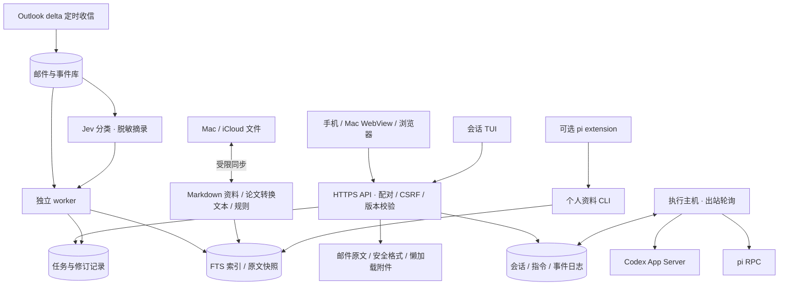

# 当前实现架构

更新：2026-09-22。本页描述仓库主路径及此前已完成的部署；不是本轮重新进行的线上状态审计。未来自迭代与注册设计见 [SELF-EVOLUTION-ARCHITECTURE.md](SELF-EVOLUTION-ARCHITECTURE.md)，其新增接口尚未实现。

## 已有能力与边界

- 云端是任务状态权威来源，手机和 Mac App 直接访问公网 API。Mac 离线时云端继续收信、分类与处理任务；运行在 Mac 的编码会话仍依赖 Mac 在线。
- Outlook 个人邮箱读取已接入；Jev 用于授权范围内的邮件摘录分类。验证码优先显示，原文正文先于附件清单加载，外部图片由用户确认。附件缩略图使用 Pillow，因此不能再声称主路径不依赖 Pillow。
- 回复模板由用户显式触发，当前不提供自动对外发送。Web Push 与原生 APNs 的完成度不同，不能把推送接口存在等同于已完成真机锁屏验收。
- Markdown 是可读资料来源；扫描先比较文件元数据，变动时计算 hash，并周期审计。论文转换文本进入检索；当前主检索是 FTS，尚不能宣称已完成语义向量检索。引用保留来源位置与版本。
- 索引可重建；历史原文、任务修订、邮件 delta 状态、会话日志、vault 和凭证需分别备份。跨 SQLite 数据库恢复需要一致性方案，不能仅复制一个 index 文件。
- 会话支持 Host 工作区白名单、版本检查、指令幂等、事件重放与持久 outbox。现有 Codex 桌面会话采用只读观察；托管会话由 Host 创建。Linux 两个托管 Host 经授权配置完整工具权限；远程审批 UI 尚未实现，默认 Host 策略不变。
- 会话不保证 exactly-once：结果不明时标记 unknown，不自动重放可能产生副作用的指令。本地进程锁尚未提供跨实例独占租约。
- `oneai/legacy/` 与 legacy 测试为显式入口；支持路径默认使用 `tests/core/`，客户端和 extension 测试由 `scripts/check.py` 汇总。GitHub CI 与该本地入口尚有覆盖差异。

## 部署与后续

当前部署脚本仍有原位覆盖、人工验证和备份步骤，尚未建立 GitHub 制品到生产的可信自动发布链路。自迭代前优先补会话所有权、注册入口、发布原子切换与回滚。

详细文档：[客户端](CLIENT-ARCHITECTURE.md)、[会话](SESSION-ARCHITECTURE.md)、[下一版提案与评审](SELF-EVOLUTION-ARCHITECTURE.md)。配置仍以 `ONEAI_VAULT_PATH`、`ONEAI_STATE_PATH` 为主；模型账户、Outlook/Jev token 和 Host 私有配置不进入 Git。

模块化插件设计见 [PLUGIN-SPEC.md](PLUGIN-SPEC.md)：解析、检索、分类、运行时与设备操作通过受控接口扩展。已实现轻量 Registry/Runner 与独立进程 action.provider.v1 子集，见 [PLUGIN-RUNTIME.md](PLUGIN-RUNTIME.md)。现有 Adapter 与 Jev 代码仍按当前主路径运行，尚未迁入插件注册表。
