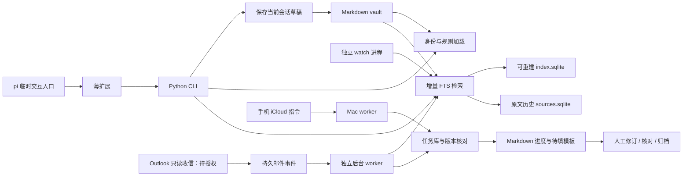

# 当前实现架构

本文描述已落地代码；未来服务与界面在 SPEC-NEXT.md。2026-09-21 评审中的旧路径保留为历史记录。

## 一致性与边界

- CLI search 与独立 draft 先同步；watch 可独立周期扫描。现在仍每次读取 Markdown 计算 hash，避免仅依赖 mtime 漏改。该实现面向笔记，论文大规模导入将在独立管线处理。
- 索引维护文件版本；删除和改名会移除旧路径。全文重建在一个 SQLite 事务内更新，失败回滚。
- FTS 标题元数据与原文片段分开；引用对应实际文件行。原文快照另存 `sources.sqlite`，删除索引不影响已归档证据。
- vault 读取、写入和指定文件索引校验根目录边界；拒绝绝对路径、上级路径和外部符号链接。这里不是对同一系统用户恶意并发修改目录的操作系统沙箱。
- 草稿原子写入，保留明确版本的来源。pi 的正文直接保存，不再二次生成；独立 `oneai draft` 仍是单轮模型调用。
- 每轮 pi 调 `context`，加载用户身份和 `rules/`；失败不静默忽略。草稿的 `context_versions_at_save` 表示保存时的规则版本，不冒充模型确实采用了每条规则的证明。
- 本地草稿无需发送批准。没有对外发送/提交实现；未来授权必须由服务层执行，不能把 Markdown status 字段作为权限凭证。

## 隔离

`oneai/legacy/` 只通过显式 legacy 命令启用；主路径不导入 Textual、Pillow 或旧 Runtime。默认 Python 测试只运行 `tests/core/`；Node 桥接与真实 pi 扩展加载测试在 `tests/extension/`。没有安装 pi 时，其特定集成测试跳过。

`connectors/outlook/` 已提供只读授权与持久化 delta 收信，部署单元在 `deploy/systemd/`，邮箱尚未实际授权。`work` 表由独立 worker 幂等消费，形成可修订、核对和归档的任务；当前只生成本地待填模板。`ledger.py` 仍是实验骨架；两者不提供 exactly-once 对外操作承诺。详见 OUTLOOK-DEPLOYMENT.md。

## 运行与备份

| 配置 | 含义 |
|---|---|
| ONEAI_VAULT_PATH | Markdown 资料根目录，默认 Mac iCloud 路径可用时使用该目录 |
| ONEAI_STATE_PATH | 索引、原文历史和事件记录，默认 ~/.oneai/state |
| ONEAI_PYTHON / ONEAI_CLI | pi 桥接进程；启动器自动设置 Python，CLI 显式覆盖优先 |
| DEEPSEEK_API_KEY / DEEPSEEK_BASE_URL / ONEAI_MODEL | 仅独立 draft/legacy 模型调用配置；pi 采用自己的模型配置 |

必须备份 vault 与 sources.sqlite；index.sqlite 可重建。历史快照暂无自动清理或彻底遗忘命令。当前 tasks.sqlite（任务、修订历史、核对记录）和 outlook.sqlite 也必须备份；令牌缓存按敏感凭证保护。

`oneai watch` 只负责索引，不是后台任务服务。新增 `oneai.worker` 负责独立任务处理；Mac LaunchAgent 已运行，云端使用 systemd。手机 iCloud 文件入口依赖 Mac 在线，尚无云端手机 API。`scripts/paper_pilot.py` 提供独立的本地 PDF 页码索引实验，尚未接入 oneai 主检索。
