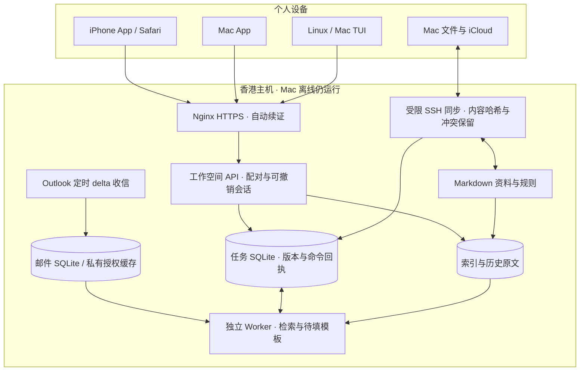

# oneAI 客户端与云端架构

手机和 Mac 客户端直接连接云端，不经 Mac 转发。SSH 同步用于文件和旧手机指令入口；应用 API 用于实时任务列表与编辑。公网 API 已在前续工作中部署；本轮未重新审计线上状态。自迭代发布与会话注册的新设计见 [SELF-EVOLUTION-ARCHITECTURE.md](SELF-EVOLUTION-ARCHITECTURE.md)。

资料以 Markdown 为可读事实来源；索引可重建，但历史原文与任务数据库需要备份。云端是任务状态权威来源；Mac 不执行另一份任务队列。离线重试复用命令 ID，修改与核对必须携带当前版本。

应用运行时与模型解耦。当前工作器仅检索和生成保守模板；以后模型作为起草步骤加入，不能绕过版本确认与外部发送授权。检索引擎也作为独立部件演进：论文解析、全文索引、向量索引和引用验证共享文献 ID，但不把整篇论文塞入永久提示词。

预算内优先共用现有 1GB 云主机。论文解析与嵌入暂放 Mac 批处理，云端仅存所需索引和任务；完成真实论文检索评测后再决定是否迁移计算。没有额外购买服务器或订阅。
