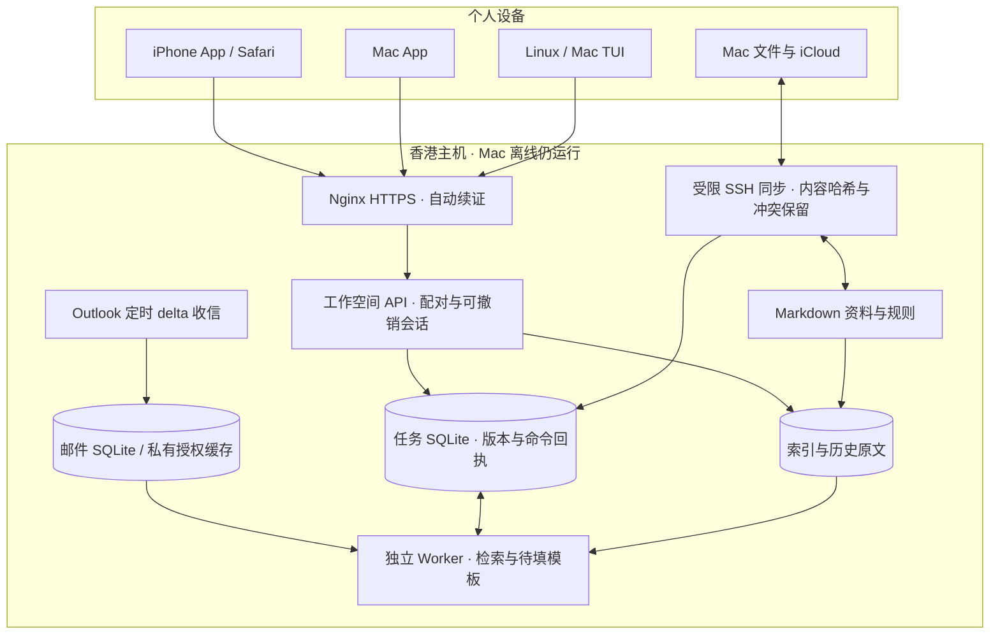

# oneAI 客户端与云端架构

手机和 Mac 客户端直接连接云端，不经 Mac 转发。SSH 同步用于文件和旧手机指令入口；应用 API 用于实时任务列表与编辑。公网 API 已在前续工作中部署；本轮未重新审计线上状态。自迭代发布与会话注册的新设计见 [SELF-EVOLUTION-ARCHITECTURE.md](SELF-EVOLUTION-ARCHITECTURE.md)。

资料以 Markdown 为可读事实来源；索引可重建，但历史原文与任务数据库需要备份。云端是任务状态权威来源；Mac 不执行另一份任务队列。离线重试复用命令 ID，修改与核对必须携带当前版本。

应用运行时与模型解耦。当前工作器仅检索和生成保守模板；以后模型作为起草步骤加入，不能绕过版本确认与外部发送授权。检索引擎也作为独立部件演进：论文解析、全文索引、向量索引和引用验证共享文献 ID，但不把整篇论文塞入永久提示词。

预算内优先共用现有 1GB 云主机。论文解析与嵌入暂放 Mac 批处理，云端仅存所需索引和任务；完成真实论文检索评测后再决定是否迁移计算。没有额外购买服务器或订阅。

## 手机触控与临时配对码（2026-09-22）

应用 DOM（含滚动容器、弹窗和动态邮件内容）统一设置 `touch-action: manipulation`，抑制双击页面缩放，保留滚动、文本选择与双指缩放；不添加全局 touchend preventDefault。输入框继续使用移动端至少 16px 的字号，避免聚焦自动放大。依据 [WebKit 触控说明](https://webkit.org/blog/5610/more-responsive-tapping-on-ios/)。Service Worker shell 缓存版本更新为 v4。

管理员 CLI `python -m oneai.web pair --code <四位数字>` 可指定本次临时码；不传参数时仍随机生成。保持十分钟失效、一次使用、单个有效码与现有失败次数限制，不提供永久通用 PIN，指定码不写入源码或 Git。Web 配对 API 仍生成随机码。

验证：23 项 Web/认证测试通过；新增覆盖指定码替换、单次使用、到期、失败预算保留及非法参数不破坏已有码。公网代码已按本地文件 SHA-256 校验后部署。Chrome 390px 下首页和邮件详情双击后 scale=1、无横向溢出，滚动容器的 computed touch-action 为 manipulation。该检查不等同真实 iOS 触摸：本轮 Simulator 截图返回空白、AX 无 Web 内容，重连后仍未完成原生手势验收。实际指定配对码设置由用户在云端命令页完成，未由本轮自动执行。

## 筛选切换与配对入口（2026-09-22）

设备页原按钮“连接新设备”改为“生成四位配对码”，说明点击后在另一设备输入；生成过程中禁用按钮，成功后滚动到结果，失败后可重试。

任务列表使用仅驻留当前页面内存的缓存，key 包括 status、query、mail_view、offset，最多 20 页、15 秒新鲜期。访问过的第一页即时展示；过期时标注缓存并后台更新，同 key 请求合并。首次未命中显示加载提示，不继续展示上一分类。请求 sequence 和缓存 generation 避免旧请求覆盖当前筛选，以及退出登录/任务操作后重新填入过期缓存。核对、归档、恢复、创建、修改等命令提交前及成功后失效缓存；API 仍为 no-store，不将邮件列表写入 Service Worker 或持久缓存。周期轮询/手动刷新强制更新当前列表；后续 status 与列表并行请求，首屏使用 bootstrap 聚合。其他设备的变化在下一次刷新被获取，缓存不替代服务端 revision 校验。

增加 `tasks_status_display_date(status, COALESCE(mail_received,updated) DESC, id DESC)`，匹配分类列表排序。上线后样本查询返回 50 行耗时 2.13ms，查询计划使用该索引；这是服务器 SQL 耗时，不是完整网络或页面渲染时延，也没有改前基准可用于声称倍数提升。

验证：165 项 Python core 测试、15 项客户端测试通过，包含缓存命中、过期刷新、乱序响应、请求去重、分页、失效和筛选隔离。公网 390px 检查五类筛选与设备页；无横向溢出，缓存分类可立即展示，冷分类显示加载提示。本轮未执行会消耗配对码的登录操作。

后续性能路线与可复现基准见 [PERFORMANCE-PLAN.md](PERFORMANCE-PLAN.md)：优先常用分类预取、bootstrap 和无变化不重绘，再做持久变更游标与 SSE。首批分类预取、bootstrap、按 ID 更新已实现；SSE 和持久本地投影仍是研究方案。

### 首屏与增量绘制

`GET /api/bootstrap` 是展示层聚合入口，认证、任务、状态的领域接口继续保留，插件和会话接口不依赖此入口。前端可回退至旧后端；云服务升级不需要重建原生客户端。首屏后独立加载提醒，空闲时预取最多四个分类第一页，弱网提示/省流量模式跳过，前台请求优先。预算、缓存一致性与分页边界详见性能计划的“首批实现”。不变行保留 DOM，只更新变化内容；Web、iPhone 和 Mac WebView 共用实现。

### 邮件展示与手动刷新（2026-09-23）

邮件原文在语义排版完成前只显示加载状态，不插入同步纯文本。失败时提供重试及默认折叠的“查看同步时的文本”；成功后的原始 HTML/纯文本折叠入口保留。

任务/邮件页面取消 15 秒定时轮询。首次打开/登录通过 bootstrap 更新；回到前台、浏览器恢复页面及网络恢复时刷新；用户可点击刷新，或在手机任务页所有滚动容器到顶后单指下拉至少 80px、松开刷新。编辑草稿、输入区域、横向滑动、多指和弹窗不触发；进行中的刷新合并，保留最多 500 条已加载列表。手动刷新失效列表与邮件展示内存缓存；未提交的编辑不被覆盖。

仅改变前端获取时机，云端收信/分类/推送照常运行；Codex/pi 会话页仍保留独立实时更新。此段替代上文旧版本的“周期轮询”说明。23 项客户端测试通过，真实 iPhone 下拉手感需用户验收。
