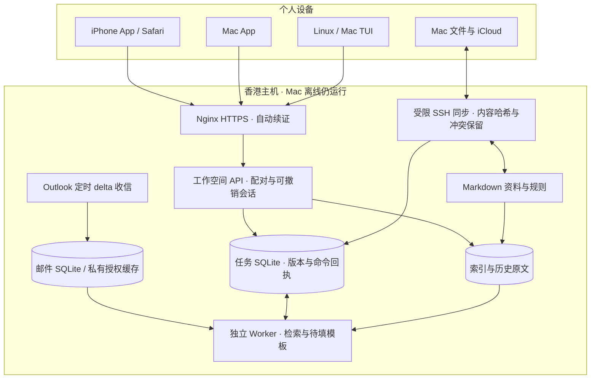

# oneAI 客户端与云端架构

手机和 Mac 客户端直接连接云端，不经 Mac 转发。SSH 同步用于文件和旧手机指令入口；应用 API 用于实时任务列表与编辑。公网 API 已在前续工作中部署；本轮未重新审计线上状态。自迭代发布与会话注册的新设计见 [SELF-EVOLUTION-ARCHITECTURE.md](SELF-EVOLUTION-ARCHITECTURE.md)。

资料以 Markdown 为可读事实来源；索引可重建，但历史原文与任务数据库需要备份。云端是任务状态权威来源；Mac 不执行另一份任务队列。离线重试复用命令 ID，修改与核对必须携带当前版本。

应用运行时与模型解耦。当前工作器仅检索和生成保守模板；以后模型作为起草步骤加入，不能绕过版本确认与外部发送授权。检索引擎也作为独立部件演进：论文解析、全文索引、向量索引和引用验证共享文献 ID，但不把整篇论文塞入永久提示词。

预算内优先共用现有 1GB 云主机。论文解析与嵌入暂放 Mac 批处理，云端仅存所需索引和任务；完成真实论文检索评测后再决定是否迁移计算。没有额外购买服务器或订阅。

## 手机触控与临时配对码（2026-09-22）

应用 DOM（含滚动容器、弹窗和动态邮件内容）统一设置 `touch-action: manipulation`，抑制双击页面缩放，保留滚动、文本选择与双指缩放；不添加全局 touchend preventDefault。输入框继续使用移动端至少 16px 的字号，避免聚焦自动放大。依据 [WebKit 触控说明](https://webkit.org/blog/5610/more-responsive-tapping-on-ios/)。Service Worker shell 缓存版本更新为 v4。

管理员 CLI `python -m oneai.web pair --code <四位数字>` 可指定本次临时码；不传参数时仍随机生成。保持十分钟失效、一次使用、单个有效码与现有失败次数限制，不提供永久通用 PIN，指定码不写入源码或 Git。Web 配对 API 仍生成随机码。

验证：23 项 Web/认证测试通过；新增覆盖指定码替换、单次使用、到期、失败预算保留及非法参数不破坏已有码。公网代码已按本地文件 SHA-256 校验后部署。Chrome 390px 下首页和邮件详情双击后 scale=1、无横向溢出，滚动容器的 computed touch-action 为 manipulation。该检查不等同真实 iOS 触摸：本轮 Simulator 截图返回空白、AX 无 Web 内容，重连后仍未完成原生手势验收。实际指定配对码设置由用户在云端命令页完成，未由本轮自动执行。
