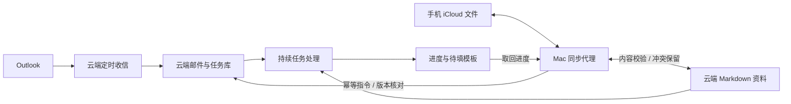

# 云端持久化与双向同步

任务和 Outlook 状态以香港云主机为准。Mac 负责把 iCloud 中的指令与 Markdown 资料同步过去，取回云端进度。Mac 休眠不影响已经接收的任务；尚未离开 iCloud 的新指令要等 Mac 恢复在线。当前尚无手机直连云端界面，因此不是完全摆脱 Mac。

## 同步范围

- 双向：vault 中的 Markdown，包括规则、资料和草稿。每份最多 2 MB；不跟随符号链接、隐藏路径。
- 上行：`inbox/commands/*.json`；云端按指令 ID 去重，并校验任务版本。
- 下行：云端任务视图写入 `inbox/cloud-tasks/`，与旧的本地任务视图区分。
- 不传输 SQLite、OAuth 令牌、SSH 私钥、PDF 原件或模型。云端重新构建自己的索引。
- 本地 `oneai task` 命令在启用云同步后也操作云端。旧本地 tasks.sqlite 保留，不自动合并。

## 一致性

每次保存成功的共同内容 hash；两端均修改时不覆盖任意一端，远端版本保存在 Mac `ONEAI_STATE_PATH/sync-conflicts/`，旁边 JSON 记录原路径。解决时先比对两份，再将双方编辑为同一内容，下一轮恢复共同版本。删除暂不传播，缺失的一端会恢复文件，避免 iCloud 暂时不可用造成云端删库；需要彻底删除时先停同步并人工处理两端及历史。

上传使用期望旧 hash 比较后写入；回复丢失可安全重试。云端旧资料保存在 `sync-history/`。邮箱任务库和令牌始终留在云端。任务核对仅表示该版本已核对，不代表已发送。

目前每轮按内容扫描，适合笔记规模；数千篇论文仍应通过单独的解析、索引管线导入。没有承诺实时同步或跨文件整体事务。

## 传输与运维

Mac 到云端使用 SSH，加密连接并固定已通过阿里云控制台核对的主机公钥。独立密钥绑定 root 管理的 forced command，只能调用同步 RPC；禁止 shell、端口转发、TTY、密码认证和用户启动脚本。RPC 只处理限定路径的笔记及任务命令，不能获取邮箱令牌。

云端安装入口为 `deploy/install-sync.sh <public-key-file>`。Mac 配置 `ONEAI_STATE_PATH/cloud-sync.json`，字段 `target`、`identity`、`known_hosts`。该配置存在时 worker 切换到云同步模式。私钥与配置不进入 Git；迁移电脑需重新配置。

网络失败不确认指令，后台服务重试。`.receipt` 表示云端已接受或明确拒绝；不存在回执时不能视为已提交。旧版本修订会被拒绝，应刷新进度后提交新的指令 ID。

停止 Mac 服务：`launchctl bootout gui/$(id -u)/com.oneai.worker`。撤销同步密钥：在云端移走 `/etc/oneai/ssh/authorized_keys`，不会删除资料。云端主机磁盘持久化不等同于异地备份；还需要用户管理的备份策略。
