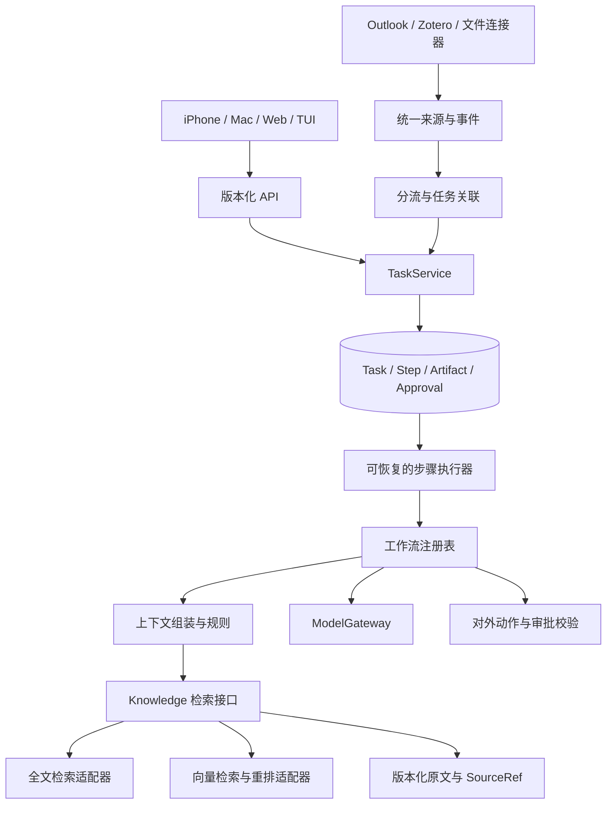

# 可扩展性审查 · 2026-09-21

审查基线：Git `914b019`，当前主路径与客户端代码。云端已经运行的服务和已上传但未启用的客户端候选版本不能视为相同版本。本次只审查与做隔离复现，没有修改运行时或部署服务。

## 结论

现有代码适合作为单人助手的最小闭环：云端状态独立、客户端共享接口、命令幂等、草稿版本检查、历史原文引用都值得保留。但是新增任务类型、模型、论文检索和多步骤工作流仍需要修改核心代码，尚未达到 spec 中的可组合能力架构。

优先补业务边界与恢复机制。推荐继续采用模块化单体、SQLite 和独立 worker，先让组件接口稳定。没有进行容量压测，不据此断言现有服务器能支持某个论文数量、并发量或响应时间。

## 需要先处理的问题

### P1：一项资料错误会阻塞其他任务

位置：`oneai/worker.py:54`、`:59`、`:89`、`:106`。

索引更新、任务检索和起草在一次串行 tick 中执行，没有逐文档/逐任务错误隔离。worker 没有持久步骤、领取租约、重试次数、下次重试时间和失败队列。进程自动重启能恢复进程，却不能绕过持续失败的输入。

隔离复现：创建一项正常任务，并添加一个非 UTF-8 的 `.md` 文件。连续两次 tick 都抛出 UnicodeDecodeError，正常任务保持 pending；移除该文件后任务正常准备完成。以后加入 PDF 解析或模型请求，新增失败点也会进入这条共同路径。

建议：先隔离文档导入失败；再增加 `steps` 记录和条件领取，计算完成后提交结果。每一步持久化 attempt、lease_until、next_retry_at、error_code；失效输入进入可查看的失败状态。不要通过增加并发 worker 掩盖这个问题。

### P1：事件身份与任务身份混在一起

位置：`connectors/outlook/connector.py:128`、`oneai/worker.py:27`。

邮件队列正确地把不同内容版本保存为不同事件，但任务创建也直接使用事件 ID。若第一版已经生成任务，随后同一封邮件出现内容更新，又会建立一个任务。对完全相同事件的幂等并不能解决同一业务对象多版本的问题。

隔离复现：同一个 message ID 先后输入两个不同 subject 的版本，每次都执行 ingest_mail，结果是两项任务。这个结论不代表现实邮箱中的所有更新都一定生成重复任务，只证明当前身份设计允许该情况。

建议：分别维护 `source_id`、`source_version`、`event_id`、`workflow_instance_id`。以连接器实例 + 来源对象 + 工作流实例关联任务，把来源修订写为事件。收到修订后更新待准备任务，或把已有草稿标记为来源变化、等待重新核对；不得静默覆盖用户修改。历史邮件优先索引，经过分流后再建立需要处理的事项。

### P1：任务模型只能表达一份待核对文本

位置：`oneai/tasks.py:22`、`oneai/worker.py:54`、`oneai/web/app.py:136`。

Task 同时装着目标、执行状态、唯一结果正文和批准版本；worker 使用固定通知模板。没有 workflow_type、工作流版本、多个输出物、追问/回答、等待设备/认证、取消和步骤恢复。添加论文对比、周期性计划或材料收集，需要改 worker、状态机、API 和客户端条件分支。

尤其需要澄清：当前 worker 加载规则后只把路径与版本写进结果记录，模板本身仍写死在代码中；并未把任意新增规则的正文用于决策。其他起草入口的上下文加载，不能替代后台工作流的规则执行。

建议：先拆出 Task、Step、Artifact 三类对象；审批绑定具体 Artifact 版本与拟执行动作。以普通 Python 注册表加载少量明确的工作流，不建立任意代码插件市场。新流程只添加定义、步骤实现和验收案例，保持 API 与客户端兼容。

## 随能力和数据增长会暴露的限制

| 优先级 | 位置与现状 | 扩展代价 | 建议 |
|---|---|---|---|
| P2 | `sync.py:184` 每轮从空 cursor 下载全部任务视图；`tasks.py:96` 每轮导出全部任务 | 分页降低单次内存，但总体网络量和扫描量仍随整个历史库增长；已有指令文件也反复提交 | 增加单调 change_seq 和设备同步游标，只同步变化；支持 tombstone、游标过期后的全量恢复；保留周期性对账 |
| P2 | `web/app.py:119` 用 OFFSET，任务库缺少查询所需的复合索引 | 持续更新时分页可能重复或遗漏，深分页和排序扫描越来越多 | `(status, updated, id)` 等按查询设计的索引；稳定复合游标；有需要时才引入任务文本索引 |
| P2 | `web/app.py:161`、`indexer.py:232` 绑定 Markdown 路径、版本和行号 | PDF 页码、Zotero ID、表格位置与不同检索引擎无法直接复用引用契约 | 统一 `Document` 与结构化 `SourceRef`；位置使用 Markdown 行范围 / PDF 页与 bbox 的类型联合；旧引用继续可读 |
| P2 | `web/app.py` 直接操作 SQL，HTTP、SSH、CLI 各自验证与序列化 | 增加一种命令或状态要多处同步，容易出现某个入口漏校验 | 一个 TaskService 负责业务规则；入口只负责认证、请求校验与传输；增加 API 版本和统一错误码 |
| P2 | `web/static/app.js` 集中页面、状态、请求重试与存储逻辑；SwiftUI 是 WebKit 容器 | 共享界面易维护，但完整离线、推送、分享扩展与原生 PDF 阅读尚未具备 | 先拆 API/store/views 模块；随后按真实需求添加有类型的原生桥接与设备能力协商 |
| P2 | SQLite 建表使用 CREATE TABLE IF NOT EXISTS，无显式迁移版本 | 新字段上线后旧数据库和旧客户端可能不兼容；代码回滚不等于数据回滚 | 迁移编号、升级前备份、旧客户端兼容窗口、旧数据库升级测试 |
| 后续 | 配对设备均具有相同权限，没有工作区隔离 | 多用户或只读设备会扩大权限范围 | 保持明确的单人系统定位；需要时增加设备 scope。不要直接当作多租户产品开放 |

隔离测量：105 条合成任务连续同步两次，期间没有任何修改；两次均发生 4 次 RPC，其中 3 次为任务视图分页，第二次仍重新传输所有 105 条视图。分页修复有效地限制单页处理范围，但尚未实现增量传输。

查询计划检查：当前按状态筛选并按 updated/id 排序的任务列表显示 `SCAN tasks` 和 `USE TEMP B-TREE FOR ORDER BY`。这说明存在扫描与临时排序，不等于已测出实际响应时间超标。

## 建议的扩展边界

这是建议结构，不是当前已实现功能，也不要求拆成多个网络服务。

最小契约：

- `Connector.poll(cursor) -> events, next_cursor`：连接器负责来源身份与版本，不直接创建每一项任务。
- `WorkflowDefinition(type, version, input_schema, steps)`：任务固定所用版本，升级规则不改变运行中任务的解释方式。
- `Knowledge.search(query, filters) -> Evidence[]`；`Knowledge.read(SourceRef)`：检索结果和可验证原文保持同一引用契约。
- `ModelGateway.generate(context, output_schema, budget)`：记录输入版本、输出和错误；模型不能直接改审批。
- `TaskService.command(command_id, expected_revision, payload)`：保留现有幂等和版本检查，统一供各客户端使用。

## 落地顺序与验收标准

1. **故障隔离 + 邮件身份与分流。** 一份坏文档不挡其他任务；同一来源修订不重复建事项；用户草稿不被新邮件版本覆盖。
2. **TaskService + Step/Artifact + 数据迁移。** 加入“论文对比”这一条新工作流时，不修改各客户端的业务判断；步骤中断后恢复，已确认输出不重复执行。
3. **结构化引用 + Knowledge/ModelGateway。** 同一个 API 返回 Markdown 行证据和 PDF 页证据；替换检索实现不用改手机界面；模型超时只影响对应步骤。
4. **变化游标与查询索引。** 无变化时不下载任务正文；新增或修改一项只同步该项变化；重连与游标过期可恢复。
5. **按需要扩展原生能力。** 推送、分享入口、完整离线库分别验收，不把 WebKit 容器等同于这些能力已经具备。

还需要用用户的真实论文集合做解析质量、引用定位、检索召回和资源占用评测；本次代码审查不替代这些结果。旧 `SPEC-NEXT.md` 的“暂不做原生 App”等状态说明已落后于当前实现，下一次 spec 修订应把已实现、已验证和提案分开维护。
