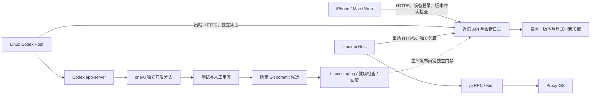

# 手机开发与扩展边界 · 2026-09-23

## 本轮结构

Linux Host 由 systemd 用户服务管理，退出 SSH 或关闭 Mac 不应停止会话。手机对 Host 提交幂等命令，Host 是运行时 stdin 的唯一写入者；不要另开终端附着同一活跃运行时写入。Mac 当前任务继续独立运行，手机自开发入口使用专用 oneAI 会话及交接文档，不假装已共享当前桌面任务的控制连接。

oneAI 自开发使用 `~/oneai-data/owner/workspaces/oneAI`，分支 `codex/mobile-self-development`；Host 服务代码来自 `~/oneAI`，避免一边修改代码一边改变自己的运行进程。手机提交开发任务只授权该任务，不能把模型生成的发布指令视作生产发布授权。已注册 workspace 是可选项目范围，不是完整 OS 文件隔离；steven 下的两个 Host 仍属于同一个信任主体。

## 可扩展性 review

运行时通过 `oneai/sessions/adapters.py` 的统一生命周期构造、prompt、interrupt、close 和事件接口接入。HTTP 路由只管理命令与日志，不执行 provider 程序。客户端按事件类型渲染，不直接调用 Codex/pi。设置页改名保留内部 `devices` 页面标识，兼容旧引用。

目前仍有必须明确的缺口：

- `ADAPTERS` 和服务端 provider 白名单仍为内置注册，尚没有第三方插件发现、Broker、Runner 或安装界面。不能把 spec 描述当作已实现的插件系统。
- Codex 可在 workspace-write 内开发；额外权限审批当前拒绝，尚无手机审批卡片。pi 此入口只开放 read/grep/find/ls，关闭自动扩展加载，不开放任意 shell。
- 插件第一阶段应实现 manifest/API 版本校验、受控本地注册及契约测试，再将内置 Codex/pi 迁入同一 registry；第二阶段才开放独立进程插件、能力白名单、升级排空和故障隔离。接口与权限细节见 [PLUGIN-SPEC.md](PLUGIN-SPEC.md)。
- 现有独立 Host 凭证隔离的是主机派发与事件写入，手机仍是单人设备共享权限；未完成 tenant、OS 用户隔离前不开放多用户注册。
- “检查更新”检查已部署的界面版本，不等于允许从手机将任意 Git 分支直接发布。生产自更新还需可信制品、锁定依赖、兼容迁移及独立发布权限。

## APNs 实测与接入顺序

当前签名团队为 Personal Team。2026-09-23 使用独立 DerivedData 和临时 `aps-environment=development` entitlement 实测，Xcode 明确返回：Personal development teams do not support the Push Notifications capability。当前已安装应用未改动，仍可运行；未取得 APNs token，也未向 APNs 发出通知。

需要先有支持 Push Notifications 的 Apple Developer Program 团队，再依次完成：

1. 给 `org.oneai.personal.ios` App ID 开启 Push Notifications，重新生成描述文件；development 与 production 环境分别校验。
2. 在系统钥匙串/服务器受限密钥目录配置 APNs `.p8`、Key ID、Team ID；不提交 Git，不交给开发模型上下文。
3. 原生通知 adapter 使用 UIApplicationDelegate 注册 APNs，向用户请求通知权限，处理 token 更新；只能向当前已登录的同源 oneAI 服务提交 token。
4. 服务端将 token 绑定登录设备、用户、bundle 与环境；退出/撤销取消待发通知。通知 worker 复用事件与 outbox 语义，APNs 为独立 delivery provider；不能用原生 token 冒充 Web Push endpoint。
5. HTTP/2 APNs sender 校验 TLS，处理 410 token 失效、429/5xx 退避、过期与去重；日志不记录 token、验证码或邮件正文。
6. 真机验证前台、后台、锁屏、点击跳转、换 token、退出后不再发送。服务商接收成功与手机显示分开记录。

以上原生 adapter/sender 尚待实现及付费团队配置；现有 Web Push 不等于 WKWebView 原生 APNs。官方参考：[Apple APNs 注册](https://developer.apple.com/documentation/usernotifications/registering-your-app-with-apns)、[Codex App Server](https://learn.chatgpt.com/docs/app-server)。
