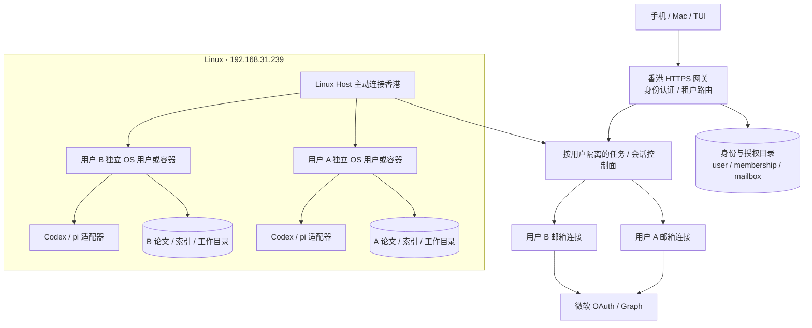

# 多用户、Linux 资料节点与统一会话

2026-09-23。状态：迁移设计与基础设施准备；当前公网应用仍是单用户版，不能给第二位用户配对后声称已隔离。Linux 实测 Debian 13、Python 3.13、Node 20，根盘约 1.7TB 可用。用户确认：独立账号，数据默认隔离；首版每人一个 Outlook，保留多邮箱能力。

## 目标拓扑

香港继续收信、排队和提供已有记录。论文原件与模型执行放 Linux；Linux 离线时，论文全文与执行明确显示节点离线，不能伪造结果。香港磁盘仅保存必要的任务元数据/检索摘要；每用户配置保留期。迁移现有文件前生成 hash 清单、传输校验和恢复演练；不直接移动唯一副本，不通过共享 SSH 暴露资料目录。

## 网络选择与 SSH

现有两个节点先采用 OpenSSH 反向隧道：Linux 出站连接香港，绑定 `127.0.0.1:22390`；Mac 经专用跳转账号连接这个回环端口，再独立认证 Debian 的 steven。端到端校验 Debian host key，香港 host key 通过已登录云控制台读取并固定。不得用 StrictHostKeyChecking=no 或盲信 ssh-keyscan 结果。

- Linux 隧道账号：只能 remote forwarding 到指定监听端口；无 shell/PTY/agent/X11。
- Mac 跳转账号：只能 local forwarding 到上述回环端口；无 shell/PTY/agent/X11。
- 香港不开放 22390 公网端口；复用现有 22。Linux 不需要 NAT 入站规则。
- systemd 用户服务自动重连；要在登出和重启后持续运行，需要管理员 `loginctl enable-linger steven`。
- ssh_debian 使用局域网探测，失败走香港；可用 `ONEAI_DEBIAN_ROUTE=relay` 强制验收中转。探测通不等于主机可信，SSH 仍严格校验主机密钥，遇到冲突失败关闭。

这是当前双节点运维 SSH 的选择。frp 更适合集中代理多种 TCP/HTTP 服务，但当前会增加 frps/frpc 和另一套凭证；Tailscale 支持优先直连、失败中继，未来大量个人设备接入可再评估。oneAI Host 本身仍用原有出站 HTTPS 通道，SSH 隧道不成为应用 API 协议或插件依赖。

实施文件：`deploy/ssh-relay/install-hub.sh`、`oneai-hk-tunnel.service`、`ssh-debian`。脚本只负责中转，不开放共享工作空间给其他用户。

## 身份、邮箱与登录

将三个 ID 分开：`user_id`（oneAI 主体）、`identity_id`（登录提供商身份）、`mailbox_id`（邮箱连接）。禁止以 email 字符串或邮箱数量代替用户主键。

- 用户：不透明 UUID；OIDC 身份以验证后的 `(issuer, subject)` 唯一绑定。邮箱地址只作显示，不以未验证 email 自动合并账号。
- oneAI 主登录采用手机号 + 短信验证码，邮箱不充当主登录标识。首版使用阿里云号码认证 PNVS（SendSmsVerifyCode / CheckSmsVerifyCode），与普通短信服务的套餐及 API 分开。用户已授权使用阿里云余额，每月硬上限 10 元；发送前仍需核实单价、开通状态、受限凭证和测试号码。预算按最坏计费金额原子预占，超时按已计费保留预占，月底按 Asia/Shanghai 切账；达上限停止发送。
- 登录成功后，未连接邮箱时展示“连接 Outlook”；由用户在微软页面自行填写/选择账号。采用授权码 + PKCE、state、nonce，按需同意 Mail.Read，不根据手机号猜测或自动填入管理员邮箱。
- 用户在微软官方页面输入账号并完成其支持的 Authenticator/密码/Passkey 验证。oneAI 不显示收集 Outlook 密码的表单，不存微软密码或 TOTP 种子。
- 每个 mailbox 独立 provider、外部 account ID、授权状态、加密 token cache、delta cursor、同步锁、重试策略；首版用户级策略限制一个 active mailbox，将来提高限额即可。
- 新用户不能继承现有管理员的 Outlook token、Jev 授权、资料或 Codex 登录。第三方分类数据传输需各用户独立同意。
- 若未来提供 oneAI 自有 Passkey：稳定域名/RP ID、标准 WebAuthn 库、一次性 challenge、origin/RP 校验、用户验证与恢复流程；由 iCloud 钥匙串或 Google Password Manager 保存私钥。当前公网 IP 不作为正式 Passkey RP 设计。
- Authenticator 的 TOTP 和 Passkey 是不同认证因素，不混作同一种登录。优先由身份提供商管理 MFA；若自建 TOTP，单独设计恢复码、重放防护和恢复审批。

会话 Cookie：Secure / HttpOnly / SameSite，登录轮换，CSRF，同源检查和用户级撤销。未知账号默认待邀请/待激活，不让公开 OAuth 登录隐式创建可执行 shell 的租户。四位码仅用于已认证用户给自己绑定新设备，绑定 user_id、一次性短时限、限速，不是跨用户共享密码。

## 隔离边界与迁移

现有代码把单个 Config 的 vault/state、设备登录、任务、索引、邮箱、Host 和推送订阅共享；只有会话 Host 凭证范围约束，尚无 user 主体。上线独立用户前必须完成：

1. 管理员显式绑定现有 owner 身份；历史资料仅归 owner，不以“第一个新登录的人”继承数据。
2. 请求身份决定服务端 TenantContext；前端传 user_id 不作为授权依据。所有详情、附件/缩略图、原始邮件、搜索引用、设备、推送、会话事件与主机注册均带归属检查。
3. 首版建议每用户独立数据目录、SQLite、凭证目录与 worker；共享网关负责身份路由。执行进程必须是独立 OS UID 或受限容器，不能只设置不同 cwd。不能将整个 /home/steven 挂到其他人的容器。
4. 各用户唯一且独立 Host 凭证；会话注册校验 owner + host + workspace + provider。统一的是会话控制入口，不是共享 Codex/pi 账号，也不是把两个运行时的私有会话格式混为同一文件。
5. 前端草稿、pending commands、邮件缓存、Service Worker、推送订阅以 user_id 命名空间隔离；切换账号清理可见缓存和内存请求。现有 localStorage 的全局草稿 key 必须迁移，不能只改后端。
6. 恢复演练与跨用户反例测试通过后才允许邀请第二位用户；个人版继续服务直到切换完成。

逻辑存储模型：User 1:N LoginIdentity；User 1:N Mailbox；User 1:N HostGrant；User 1:N Workspace；Workspace 1:N Session / Artifact / Document。共享以显式 grant 另建，不让相同论文 hash 隐式造成跨用户可见。

## API 提案（尚未发布）

| API | 责任 |
|---|---|
| POST /auth/phone/challenges | 规范化 E.164 手机号，按号码/IP/全站限流后发送短信；返回不透明 challenge |
| POST /auth/phone/verify | 供应商核验、challenge 原子消费、邀请资格检查、轮换 Cookie |
| GET /api/me | 当前用户与可用 workspace |
| GET /api/mailboxes | 仅自己的邮箱连接 |
| POST /api/mailboxes/outlook/connect | CSRF + 已登录用户，创建邮箱 OAuth 流程 |
| GET /auth/outlook/callback | 校验用户绑定、state，保存独立 token cache |
| DELETE /api/mailboxes/{id} | 所有权检查，停同步并撤销本地授权 |
| POST /api/hosts/enrollment | 一次性、owner-bound、过期的主机注册票据 |
| GET /api/sessions | 仅自己的会话；按 host/provider/workspace 过滤 |

所有 callback 一次性、短时限；错误日志不含 code、token、验证码或邮箱正文。邮箱解除连接和重新授权不删除已有档案，是否清除档案由明确操作控制。

## 验收门槛

A/B 两用户对同一 ID 猜测、搜索、附件、设备撤销、推送、跨 Host 指令均不能越权。后台 worker 不串 token/cursor；两邮箱 message_id 相同仍隔离。前端切换账号不出现前用户草稿。OAuth 拒绝、过期、重放、错用户 callback 均失败关闭。Linux 重启自动连回香港，Mac 强制 relay 的 host key 与 LAN 相同；公网不能直接访问 22390。Codex/pi 测试只用用户明确授权的账号，并验证执行用户不能读取另一租户目录。

## 官方依据

- [OpenSSH sshd 配置](https://man.openbsd.org/sshd_config)、[authorized_keys 限制](https://man.openbsd.org/sshd)
- [Tailscale 连接类型](https://tailscale.com/docs/reference/connection-types)、[frp TCP](https://gofrp.org/en/docs/features/tcp-udp/)
- [Microsoft 授权码与 PKCE](https://learn.microsoft.com/en-us/entra/identity-platform/v2-oauth2-auth-code-flow)
- [Passkey 服务端认证](https://developers.google.com/identity/passkeys/developer-guides/server-authentication)、[Passkeys](https://developers.google.com/identity/passkeys)

### 手机号登录约束（最新用户决定）

手机号作为可更换的 LoginIdentity，内部 user_id 不变；一人多邮箱仍由 Mailbox 关系独立支持。验证码至少 6 位、短有效期、同一 challenge 最多 5 次核验；每号码 60 秒发送间隔，小时/日及全站费用预算持久化限额；服务端返回统一错误，不泄漏是否已注册。不在日志/前端响应存放验证码，供应商故障失败关闭。短信发出但响应超时不能直接重复发送，保留 request_id/业务幂等状态。换号须当前会话加强验证及新号校验，号码回收不能隐式继承旧账户。

独立用户账户未实现之前不能开放短信公开注册。首版邀请制、管理员单独迁移旧数据，手机号通过验证不自动获得执行主机权限。Passkey 和 TOTP 仍可作为未来额外认证方式，不能拿四位设备码替代短信验证码。

官方：[阿里云个人开发者短信认证](https://help.aliyun.com/zh/pnvs/use-cases/sms-verify-for-individual-developers)、[新手指引及计费提示](https://help.aliyun.com/zh/pnvs/getting-started/sms-authentication-service-novice-guide)。
