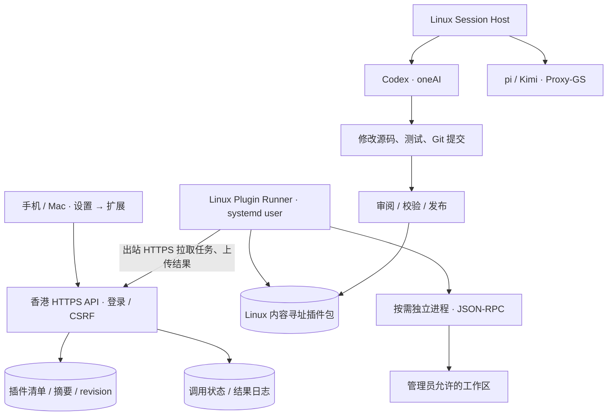

# 插件运行时与工具权限（2026-09-23）

当前是单人受信任工作空间的可运行 MVP。香港保存清单、SHA-256、启停状态与调用日志；Linux 保存实际包、执行凭证、工作区和本地回执。手机/桌面只渲染声明式表单，不运行插件提供的 JavaScript。



## 现有能力与边界

- 本地安装检查清单、路径、符号链接、大小和包摘要。按摘要保存只读包，执行前重新校验；相同版本号修改内容仍使云端停用，必须重新启用。
- 首个扩展 `oneai.workspace-review` 查询 Git 分支、改动数量及最近提交，不修改仓库。设置页可以启停、选择工作区、填写参数、查看回执。
- 清单声明 `permissions: ["owner-trusted-code"]`。目前是**进程故障隔离，不是恶意代码沙箱**；插件与会话运行在 steven 下，权限声明不构成操作系统访问控制。安装只支持本地管理员审阅后使用 `--trust-owner-code`，没有公网上传/任意 pip 安装入口。
- 工具全权限通过管理员 Host 配置 `runtime_policy: full` 开启。Codex 使用 `danger-full-access` 与 `approvalPolicy: never`；pi 开放 `read,bash,edit,write,grep,find,ls`。不自动加载 pi 第三方 extensions/skills；oneAI 扩展由独立 Runner 管理。它们可访问 steven 权限内的文件、命令与网络，不自动获得 root 或生产发布权限。其他 Host 默认保留原策略。
- 目前浏览器认证仍为 owner workspace。**不能把同一个 steven/凭证/注册表直接当作多用户隔离系统**；多用户推广前需 tenant_id 覆盖索引与任务、独立系统用户/容器、按租户凭证与配额。
- 插件不会自动成为 Codex/pi 的模型工具；本次入口是设置页的类型化 action。后续将 action registry 暴露为受权限控制的 MCP/工具适配层，无须改变包位置与调用日志协议。

## 清单与进程协议

可直接参考 [`plugins/workspace-review/plugin.json`](../plugins/workspace-review/plugin.json)。必填字段：`manifest_version=1`、`id`、三段数字 `version`、`display_name`、`description`、`interface=action.provider.v1`、相对 `.py` `entrypoint`、`input_schema`、`permissions`、`timeout_seconds`（1–60）。包限制 500 文件 / 20 MB。

`input_schema` 仅实现严格的平面对象子集：string/integer/boolean、enum、title、maxLength、minimum、maximum、required、additionalProperties=false；不宣称支持完整 JSON Schema。当前只支持 Python 标准库插件，尚无依赖安装/SDK/资源 UI 扩展。

stdin 一次 JSON-RPC 请求，stdout 一次响应：

```json
{"jsonrpc":"2.0","id":"invocation-id","method":"plugin.invoke","params":{"input":{"commits":3},"context":{"workspace":"/allowed/project","invocation_id":"invocation-id"}}}
```

```json
{"jsonrpc":"2.0","id":"invocation-id","result":{"branch":"main","changed_files":0,"recent_commits":[]}}
```

工作区绝对路径只由 Linux 配置解析，不由浏览器传入。标准输出上限 64 KB，超时终止进程组，执行子进程不继承模型/中转凭证环境变量。进程仍有 steven 的文件权限。

## HTTP 接口

| 接口 | 身份 | 用途 |
|---|---|---|
| GET `/api/plugins` | 已登录设备 | 清单、版本、摘要、在线/启停、最近 30 次调用 |
| POST `/api/plugins/{key}/state` | 设备 + CSRF | `{revision,enabled}` 乐观并发启停 |
| POST `/api/plugin-actions` | 设备 + CSRF | `{id,plugin_key,revision,workspace,input}` 幂等提交 |
| POST `/api/agent-host/plugins/inventory` | 授权 plugin Host bearer | `{items:[{manifest,digest}]}` 发布索引心跳 |
| POST `/api/agent-host/plugins/poll` | 同上 | 拉取至多一个任务 |
| POST `/api/agent-host/plugins/result` | 同上 | `{id,status,result}` 回传，校验所属 Host |

版本/状态冲突返回 409。执行身份需 `capabilities.plugins=true`；普通 Session Host 凭证不能注册/执行插件。Host 凭证不能作为浏览器身份。

提交前检查工作区、清单、启停状态和 revision。同 id 不重复入队；云端 claim 后不重新派发。本地先持久化 receipt 再执行，崩溃后标记 unknown。结果 outbox 重试上传，不重跑插件。queued 超时为 expired，running 超时为 unknown；停用取消 queued，已开始任务允许完成。UI 对结果不确定的操作不自动重试。调用结果不是无限保留文件仓库，大产物未来用 Artifact 引用。

## 安装与运行

```sh
python -m oneai.plugins.runner install plugins/workspace-review \
  --root ~/oneai-data/owner/plugins --trust-owner-code
python -m oneai.plugins.runner serve \
  --root ~/oneai-data/owner/plugins \
  --config ~/.config/oneai/linux-codex.json
```

受限配置文件需 chmod 600。运行使用 Linux `oneai-plugin-runner.service`，HTTP 出站复用现有 Host 身份，不新增公网 Linux 监听端口。安装文件与源码 Git 分开；Git 管理实现、示例清单和规则，生产包由摘要固定。

## Harness 研究与后续方向

参考 [DeepSeek Harness](https://github.com/deepseek-ai/deepseek-harness) 及其 [架构说明](https://github.com/deepseek-ai/deepseek-harness/blob/master/docs/architecture.md)：它采用 Cordis 插件体系，将 session 事件、tools、agent 与 loop 分开。借鉴其生命周期与事件边界，当前不替换已经验证的 Codex app-server / pi RPC；该项目仍为 developer preview，直接整体迁移会扩大维护面。

优先路线：① action 契约与故障隔离（本次）；②统一 Artifact/事件与模型工具桥接；③把解析、检索、分类等逐步迁入 registry；④多租户操作系统隔离、细粒度授权、签名分发；⑤影子测试、灰度及可回滚自更新。**修改自身代码与无人值守发布是两项权限**。设置中的“检查更新”仍只检查已发布 Web 界面，只有用户确认才重载。
