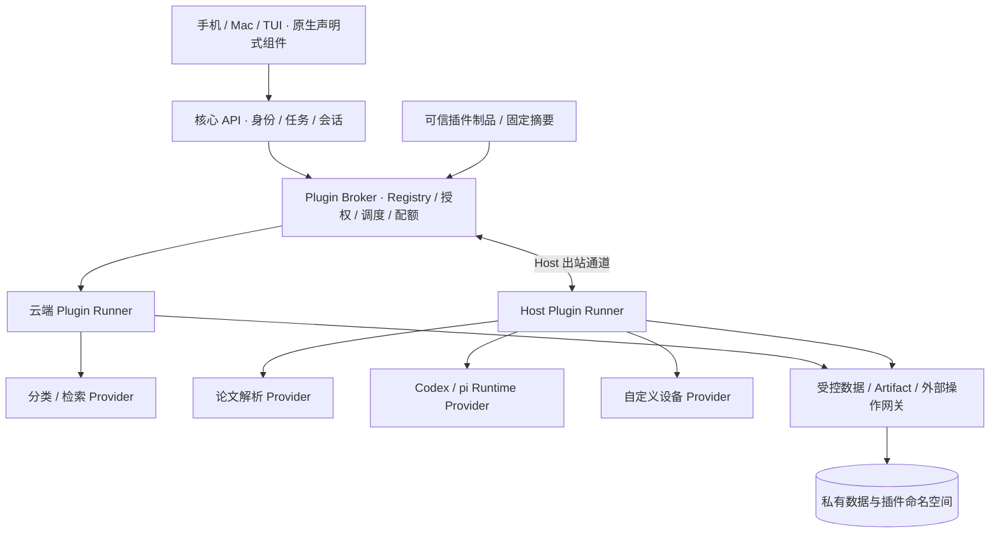

# oneAI Plugin API：已实现子集与后续提案

状态：2026-09-23，已实现 action.provider.v1 的 owner-trusted Python 子集，详见 [当前接口与运维](PLUGIN-RUNTIME.md)。**下文仍是完整目标提案，不代表所有接口已经可用**。本规范定义 oneAI 应用自身的扩展协议，不等同于 Codex 插件或 pi extension 格式。与 [自迭代架构](SELF-EVOLUTION-ARCHITECTURE.md) 一起评审。

## 1. 设计取舍

核心只管理身份、权限、任务与会话状态、审批、事件、存储入口和发布。可替换的解析器、检索器、分类器、运行时适配器和设备操作通过显式接口注册；不允许插件任意修改核心对象、数据库或 HTTP 路由。

首版采用语言无关的独立进程协议，优先服务端/Host 扩展；前端使用声明式卡片与表单，不加载插件提供的任意 JavaScript。Python/TypeScript SDK 以后提供便捷封装，协议不依赖某一种语言。1GB 云主机按需启动有限数量的插件进程；PDF 等重任务优先调度到 Mac/Linux Host。



## 2. 扩展点

| 接口 | 输入 → 输出 | 首批候选 | 核心保留的责任 |
|---|---|---|---|
| `document.parser.v1` | artifact 引用、解析选项 → 文本块、页码/位置、来源摘要 | PDF / Zotero 元数据 | 原文版本、引用校验、索引提交 |
| `retrieval.provider.v1` | query、过滤条件、limit → 文献 ID、片段、定位、score | FTS / 后续向量检索 | user-scope、结果授权与来源检查；不同 provider 分数不直接混排 |
| `mail.classifier.v1` | 经授权的标题/摘录 → 标签、confidence、理由代码、模型版本 | Jev 适配 | 验证码等保护规则、可见性阈值、人工纠正；confidence 不默认视为校准概率 |
| `runtime.provider.v1` | 会话操作 → 运行时事件与内容块 | Codex / pi 适配 | 租约、单 writer、审批与会话状态机 |
| `action.provider.v1` | 类型化 action、目标引用 → 回执/artifact | 自定义设备、未来邮件草稿操作 | 目标白名单、审批、幂等与不确定结果处理 |
| `view.contribution.v1` | 受限数据绑定 → 卡片、表单、按钮定义 | 分类说明、设备状态 | UI 渲染、鉴权、链接策略、跨端适配 |

各接口用独立 JSON Schema 定义输入、输出和错误；同一插件可贡献多个接口。ID 使用 `publisher.plugin/contribution` 命名空间。单 provider 操作明确选择配置绑定，不采用“最后加载者覆盖”；流水线固定顺序和版本，插件不能自行添加下游步骤或自动订阅全部邮件。

运行时 provider 复用会话 spec 的 create/resume/fork/prompt/interrupt/close/approve/events 契约，unsupported 显式返回。新 Provider 不获得直接操作 Registry 的能力。

## 3. 包与 manifest

最小目录：`plugin.json`、`schemas/`、`dist/`、`tests/fixtures/`、`README.md`。制品包含锁定依赖与许可证清单；不运行安装时任意脚本，不在激活时下载未固定依赖。生产按可信仓库 commit 和制品摘要安装；本地开发目录只用于明确标识的开发模式。

示例为未来本地解析插件，不代表已有命令：

```json
{
  "manifest_version": 1,
  "id": "oneai.paper-parser",
  "version": "0.1.0",
  "plugin_api": "1.0",
  "core_compatibility": ">=0.2.0 <0.3.0",
  "display_name": "论文解析",
  "execution": {
    "placement": "host",
    "transport": "stdio-jsonrpc",
    "entrypoint": ["python", "dist/main.py"]
  },
  "contributions": [
    {"id": "pdf", "interface": "document.parser.v1", "input_schema": "schemas/input.json", "output_schema": "schemas/output.json"}
  ],
  "permissions": {
    "artifact_read": "invocation_inputs",
    "artifact_write": "invocation_outputs",
    "storage": "plugin_namespace",
    "network": []
  },
  "resources": {"timeout_seconds": 120, "memory_mb": 256, "max_concurrency": 1},
  "ui": {"cards": []}
}
```

版本号为示例兼容约束，不是当前核心版本承诺。entrypoint 是包内相对路径和参数数组，由受控环境启动，禁止 shell 拼接、路径穿越和逃逸包根的符号链接。manifest 声明只是权限申请：管理员/策略的实际授权与额度可以更窄，插件自己不能扩大。

配置由 schema 描述，普通配置与 secrets 分离；manifest、Git 和浏览器不保存秘密值。第三方 API 优先由受控连接器代调用；确需秘密的可信适配器，只在指定 Host 按调用获取限定服务的凭证，不继承生产进程环境。

## 4. 调用与事件协议

使用 JSON-RPC 2.0 over stdio JSONL，stdout 只承载协议，stderr 经脱敏和限额写诊断日志。Broker 与本地 Runner 握手；远程 Host 复用已有认证出站通道，不开放公网插件端口。

| 方法 | 语义 |
|---|---|
| `plugin.initialize` | 协商 API、实例 ID、核心版本和已批准能力；不兼容则拒绝启动 |
| `plugin.health` | 返回就绪/降级、依赖可用性，不返回秘密 |
| `plugin.invoke` | 校验 interface/input，启动调用；返回 accepted，完成结果由事件记录 |
| `plugin.cancel` | 尽力取消指定调用；accepted 不等于已停止，必须有终态确认 |
| `plugin.shutdown` | 排空已有调用并退出；超时后隔离终止并标记未知结果 |
| `plugin.event` | progress、artifact、completed、failed、cancelled；按调用序号去重 |
| `broker.request` | 插件请求读取输入、写 artifact、命名空间存储或受控 action；每次验证实际权限 |

invoke 信封包含 `invocation_id, contribution_id, interface_version, plugin_version, artifact_digest, context_handle, deadline, idempotency_key, input`。context_handle 是 Broker 绑定 user/workspace/task/session 的短期不透明句柄，不接受插件自报 user_id 来扩大访问。事件包含 invocation_id、instance_id、递增 sequence、kind 与 schema 校验后的 payload；运行时事件还需携带 session epoch/turn_id。

输入和协议单条消息初始上限 256 KiB，大文件与图片只传 artifact 引用；队列有界且有背压。进度事件允许合并，终态与操作回执必须持久化；日志不能阻塞执行器。每次调用固定插件版本，新版本仅接收新调用。

投递结果不明不等于失败。read-only 调用在确认无外部副作用后可按预算重试；写操作必须由网关持久记录幂等键、查询回执。外部服务没有幂等或查询能力时，超时进入 unknown，禁止自动重发。客户端重复点击不会创建第二次 action。租约失效的运行时插件事件不得更新会话。

## 5. 隔离、安装与更新

独立进程不是安全沙箱：同一 OS 用户仍可能读取私有文件。生产 Runner 必须提供独立账户或受限容器、只读包、独立临时目录、最小环境、文件挂载和网络出口限制。无法提供所需隔离的 Host 拒绝第三方插件，仅允许明确标识并审核的内置可信适配器；不能把 manifest 白名单当作 OS 限制已经生效。

插件不得读取核心 SQLite、生产配置、其他插件私有数据，或直接访问云实例元数据服务。外部数据发送权限按目标服务、数据类别、用户范围登记；插件更新不能继承新增数据用途的授权。已有 Jev 邮件摘录授权仅适用于既定服务与范围。

生命周期：`staged → validated → disabled → enabled → draining → disabled`；校验失败为 rejected，反复崩溃进入 quarantined。设置页“扩展”展示来源、版本、运行位置、权限、最近错误、启停、更新和卸载。首次启用含数据出站/设备写入能力时展示具体权限；不对每次无新增权限的普通调用重复询问。

管理 API 提案：

- `GET /api/plugins`：可见的安装状态、贡献和健康情况。
- `POST /api/plugins/install`：提交允许来源的制品引用与固定 digest，完成预检后保持 disabled；禁止任意 URL 拉取和 SSRF。
- `POST /api/plugins/{id}/enable`、`disable`：设备认证、CSRF、expected_revision；启用时绑定已批准授权。
- `POST /api/plugins/{id}/upgrade`：展示权限与兼容差异，生成候选版本；新增权限未批准不得切换。
- `POST /api/plugins/{id}/uninstall`：先停调度/排空并撤销能力，默认保留私有数据；数据删除是单独明确操作。
- `POST /api/plugin-actions`：仅允许已注册 contribution 与经过 schema 校验的 input，使用命令 ID、版本和现有审批入口；不暴露任意 RPC 转发。

升级沿用可信制品发布链路。锁文件记录 plugin_id/version/digest、API 版本、依赖、schema 版本、placement；环境授权单独保管，不提交凭证。首版禁止插件间直接依赖或 RPC，组合经过核心任务流水线，避免加载顺序耦合和凭证传递。

候选健康检查与契约测试通过后，旧版本排空、新版本接收新调用；状态ful runtime provider 只影响新会话，既有会话固定原版本直至关闭，不热替换运行中 Codex/pi。迁移只作用于插件命名空间，遵循 expand-contract；不兼容的数据迁移阻止自动更新。回滚程序版本不回滚已发生的设备操作或丢弃新增业务数据。

禁用立即拒绝新调用并撤销网关能力，尝试取消在途调用，无法确认结果则标记 unknown；已有外部副作用不能被“卸载”撤回。插件无权更新自身的授权记录、安装器或发布信任根。

## 6. 多端界面与首批落地

卡片只使用核心组件：文本、字段、标签、表格、图像引用、折叠区和 action 按钮。按钮绑定注册 action，服务端重新鉴权；不接受内联 HTML、脚本或任意页面注入。每张卡片必须提供纯文本/TUI 回退和可访问标签，移动端按实际宽度排版。扩展升级不能增加客户端没有声明支持的必需组件。

实施顺序：

1. 先建立 schema、Registry/Broker、Runner、权限网关和 SDK 契约测试；使用纯本地无网络的示例 parser 验证加载、崩溃与禁用。
2. 选择已有 Jev 分类和论文 parser 作为首批适配。先用固定样例对比现有结果，保持输出契约和回退策略，不直接重写收信主路径。分类插件不可用时保留邮件并标记待分类，不能静默丢弃。
3. 将 Codex/pi Adapter 迁入 runtime provider 接口，前提是会话租约与审批已完成；插件不得取代会话控制层。
4. 再扩展检索 provider、设备 action 与声明式卡片；保持核心 API 兼容。自迭代任务可开发插件并提出 PR，安装和权限变化仍由发布策略执行。

验收必须覆盖：未知 API 版本拒绝；越权数据/网络/路径访问拒绝；单插件崩溃不拖垮邮件与 API；超时写操作不重放；权限增量阻止自动升级；升级中会话不中断；可恢复的排空和回滚；用户范围不交叉；协议消息超限和队列背压；手机/Mac/TUI 卡片与按钮一致。插件 CI 使用合成或脱敏 fixtures，不接触真实邮箱和生产设备。

本次仅定义 spec；不安装第三方插件，不改变现有部署，也不将上述接口标记为已可用。
