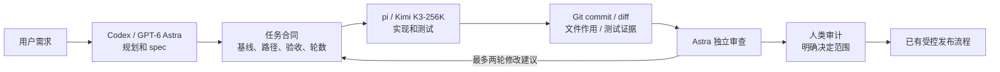

# 自迭代会话、模型和用量

更新：2026-09-23。本次实现角色提示词、模型目录/选择、用量快照和 Git 审计清单。Mix 的角色与交接契约可用；自动模型间调度、额度硬熔断与自动生产发布仍未实现。

## 日常入口

会话 → ＋新会话：选择执行主机、运行时、工作空间、角色、模型与思考强度。角色提示词可展开查看；已创建会话也能查看同一角色的版本化规范。运行中的会话不能切换模型；空闲时“模型、用量与审计 → 应用到下一轮”。切换不复制历史、不新建 native thread；长期跨模型任务可新建以管理缓存。

角色仅在新建时选择，不能静默替换已有会话的高优先级指令。Linux 管理配置 `profiles` 将角色绑定到允许工作区；普通会话仍遵守项目 AGENTS.md。Codex 使用 developerInstructions，pi 使用独立 profile.md 的 append-system-prompt；可执行工具策略仍由 Host 管理。

两种模型名称必须区分：`kimi-coding/k3-256k` / `kimi-coding/k3` 是 K3；`kimi-coding/kimi-for-coding` 不是 K3。UI 目录来自当前安装的 harness 与配置，目录中出现不代表套餐一定有调用权限；服务商拒绝时报告错误，不降级模型。

## Mix 边界

路由声明位于 `config/mix-model.json`。当前通过文件合同和会话消息显式交接，没有声称已把模型自动串成后台循环。它保留可替换 Runtime/Role/Model 三层：协议适配负责 RPC，Role 负责产物合同，Model 来自目录；未来 Coordinator 复用现有命令幂等和事件日志，避免把特定模型写死在任务核心。

默认让 Astra 只做规划和最终审查，K3-256K 做普通实现；需要大上下文时显式选择 K3。节约程度需按实际任务评测，不能用静态价格表承诺账单节省。

后续自动 Coordinator 的任务记录应包含 `task_id, spec_digest, base_sha, allowed_paths, stage, supervisor_session_id, implementer_session_id, revision_round, budget_policy, latest_review_digest`。状态只允许 spec → implementation → review → human_review；修复最多两轮。每阶段发出唯一 command_id，重启不重发不确定写操作；一个 worktree 只允许一个实现者写入。计划中的租约/隔离/硬预算尚未完成前，不开放无人值守自动循环。

## 可审计提示词

仓库基础规则：`AGENTS.md`。角色正文：`oneai/sessions/prompts/{common,self-develop,supervisor,implementer}.md`。

监工必须给出目的、准确 base_sha、允许路径、禁止范围、验收命令与交接产物。实现者必须给出实际文件作用、Git diff/commit、测试结果、风险及回滚。模板分别为 `docs/templates/MIX-TASK.md` 与 `docs/templates/CHANGE-REVIEW.md`。

“生成变更审计清单”由 Linux 确定性工具执行，不消耗模型调用：用会话起始基线比较当前工作区，列真实修改和未跟踪文件、HEAD、分支、脏状态及差异摘要。不上传文件内容或运行任意审计命令。逐文件语义仍需开发者填写；不会从文件名编造功能，也不会虚构测试通过。

生成的提示词明确写出本次目的与决定范围。模型审查通过、用户审查代码、批准合并、批准上线是不同动作。快照后有新变更必须重新生成。当前没有以该快照作为强制发布闸门的后端；审计清单本身不提供生产授权。

## 接口与存储

- `GET /api/agent/catalog`：设备认证；返回各 Host 的模型、努力级别、角色正文/摘要和采样时间。
- `POST /api/agent-host/catalog`：Host bearer；只可为其允许的 provider/workspace 发布目录。
- `POST /api/agent/commands` 新增 create.settings=`{model,effort,profile}`；configure 使用相同 settings，但不允许改角色。目录超过一小时未刷新拒绝配置请求。
- audit 命令包含 `{id,session_id,revision,action:"audit",purpose}`；闭合版本检查与原有队列一致。
- remove 只允许已关闭托管会话，从列表移除但保留审计及 Linux 原始记录。用户不能因此绕过关闭/停止流程。
- `GET /api/agent/sessions` 增加 settings 与 metrics。metrics 为 usage/model/quota/audit 的最新快照，不把累计 token 事件再次累加。
- SQLite 使用附加表 `host_catalog/session_settings/session_metrics`，不删除旧字段；Host 本地 `session_baselines` 保存基线。模型凭证不进香港数据库。

## 用量含义

Codex：thread/tokenUsage/updated 提供累计输入/输出/缓存/总 token 和最近上下文；account/rateLimits/read 提供账号共享额度与恢复时间。pi：get_session_stats 提供累计 token、上下文和运行时估算费用。每个数字有采样时间；未知与 0 区分。

Codex 订阅没有可直接推算本会话账单的价格；pi 的 `cost` 来自运行时价表，可能为 0，不等于真实免费。界面明确标为估算，不将 token 当人民币或账户剩余额度。Kimi 订阅剩余额度当前没有接入，显示“未提供”。没有自动购买/升级/充值/用量重置动作。

## 验证依据

- [Codex App Server](https://learn.chatgpt.com/docs/app-server)：model/list、thread/turn 模型与努力级别、tokenUsage、rateLimits；实现另按 Linux Codex 0.156.1 导出的 schema 核对。
- Linux pi 0.87.1 随包 `docs/rpc-commands.md`：get_available_models、set_model、set_thinking_level、get_session_stats；没有升级 harness 来凑接口。
- [Kimi 模型配置](https://www.kimi.com/code/docs/en/kimi-code/models.html)：K3 模型 ID、上下文及订阅权限差异。

## 线上验收（2026-09-23）

- 生产版本 `a2f82ff`，Linux 主仓库与开发 worktree 已同步。旧的两条测试会话已关闭并从列表移除，数据库备份和原始审计历史保留。
- 正式入口 **oneAI 自迭代 · Astra 监工**：`6deab7c7afc1417fa13e7814c249e55a`，`gpt-6-astra / high / supervisor`。
- 正式入口 **oneAI 自迭代 · K3 实现**：`292000830713443caff22712ab01bd23`，`kimi-coding/k3-256k / high / implementer`。
- 两会话真实读取 AGENTS/合同模板并返回 READY，未修改工作区。Astra 回传 token 与账号额度，K3 回传 token/上下文；K3 实际请求成功，没有用 kimi-for-coding 替代。
- UI 配置切换 Astra → Sol → Astra 收到执行端回执；未向 Sol 发送模型任务，最终保留用户指定的 Astra 监工。原 native 会话没有更换。
- 实际 audit 请求列出准确基线/HEAD、干净工作区、无变更文件及摘要；不会将“无变更”伪造为可发布代码。有文件改动及未跟踪文件的摘要变化通过 Git 集成测试覆盖。
- 本地主路径 Python 198 项、前端 Node 31 项通过；Linux 会话/模型/Web 48 项通过。390px 手机宽度下无横向溢出，模型/强度选择器宽度受卡片约束，审计提示词可换行。
