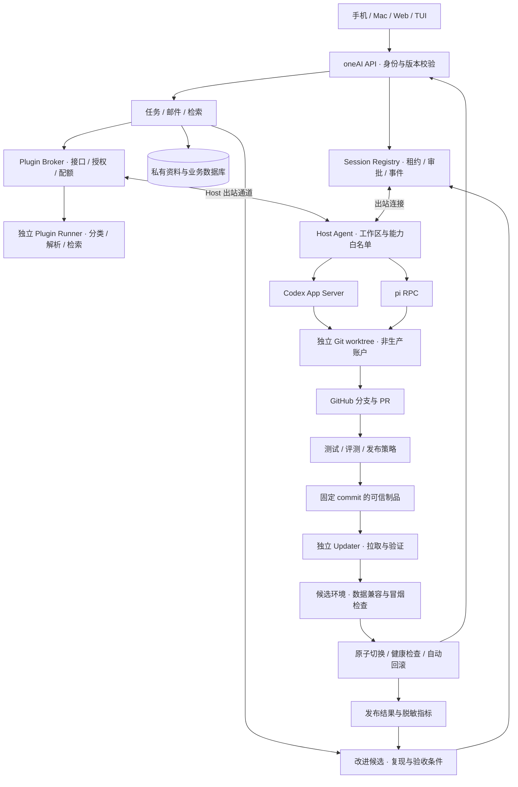

# oneAI：可自迭代架构与会话注册提案

后续进展：模型/角色/用量及显式 Mix 交接已实现，见 [SELF-DEVELOPMENT.md](SELF-DEVELOPMENT.md)；本页保留早期完整目标与差距记录，不能当成当前部署清单。

评审日期：2026-09-22。基线：`00d0f48`。状态：**设计待评审，未启用自动修改、合并或发布**。

## 1. 结论

保留 Python 模块化单体、SQLite、云端任务权威状态和出站连接的 Host。Codex / pi 是可替换的执行器，extension 是工具适配层。新增 Session Registry、受约束的改进任务和独立发布器，不再把 pi 扩展当作应用核心。模块化扩展通过 Plugin Broker 接入，接口、权限与生命周期见 [Plugin API v1](PLUGIN-SPEC.md)；插件不能替代核心授权与发布策略。

“自迭代”分成两件事：执行器提出并验证改动；发布器依据固定策略安装可信版本。执行器只能修改隔离工作区、提交分支和 PR，不能直接修改生产目录、生产凭证或自己的发布门槛。GitHub 是实现与发布来源；邮箱、论文、任务数据库和凭证不进入代码仓库。

## 2. 当前实现评审

本轮检查仓库代码、测试与官方协议；没有重新审计线上进程、GitHub 分支保护或账户套餐。下列优先级指进入自动更新前的修复顺序。

| 优先级 | 发现与影响 | 代码证据 | 建议 |
|---|---|---|---|
| P1 | 发布直接覆盖 `/opt/oneai`，失败只有重启 worker 的 trap；可能留下混合版本，备份不是自动回滚 | `deploy/activate-client-release.sh:12–16` | 不可变 release 目录、完整依赖环境、切换锁、健康检查和回滚 |
| P1 | 状态事件只验证 host 归属，没有 runtime generation、turn 或 lease；已派发指令不受 queued 检查保护，旧 idle 可覆盖新状态 | `oneai/sessions/store.py:191–220` | 服务端独占租约与 fencing epoch；按 turn/command 验证状态转换 |
| P1 | 同配置在另一目录启动可绕开本地文件锁；两个进程可用同一 Host token 领到同一会话的不同指令 | `oneai/sessions/host.py` 本地 flock；`store.py:170–184` | Host 实例身份、每会话单 writer；Host 失联时停止新操作，重新取得租约前不得恢复写入 |
| P2 | 注册需要在云端运行管理 CLI，并搬运长期密钥配置，缺少撤销/轮换和连接状态向导 | `oneai/sessions/admin.py`、`oneai/web/static/sessions.js` | 两步注册：连接执行主机，再注册其会话 |
| P2 | 注册先入库，后校验 observe 参数/写配置；失败删文件但不撤销 Host，可产生孤立记录 | `oneai/sessions/admin.py:34–44` | 先完整校验，使用 pending 注册，原子激活并清理失败记录 |
| P2 | CI 没有 extension 检查、Apple 构建、制品与发布校验；本地检查与 CI 不同 | `.github/workflows/core.yml`、`scripts/check.py` | 统一必跑检查，按改动增加平台测试，主分支成功后独立构建发布制品 |
| P2 | 当前协议 UI 以文本为主，Codex 审批被拒绝、pi 只读；无法直接承担完整开发闭环 | `oneai/sessions/adapters.py` | 添加结构化审批、文件差异与 artifact；只对隔离开发工作区开放写能力 |
| P2 | 架构文档仍称 Outlook 未授权、没有云端 API，与后续实现冲突 | 原 `ARCHITECTURE.md`、客户端和会话文档的旧状态栏 | 本轮更新总览；后续每次 release 附 capability manifest |

现有优点：设备提交使用版本校验，指令 ID 幂等，事件可以游标重放，Host 有持久 outbox；派发结果不确定时不会盲目重发。这些应保留，不宣称 exactly-once。

协议核对排除一个误报：pi 的 `abort` 官方定义为等到 idle 才返回，因此当前成功响应后发送 idle 不能单凭代码判为提前结束；仍须针对锁定版本做真实协议测试。普通运行结束应以 `agent_settled` 为准。

## 3. 目标架构



这是职责边界，不要求每个方框变成微服务。初期 API、Registry、任务模块共用现有应用；Host 和 Updater 是独立进程及权限边界。1GB 香港主机优先继续承载邮件、中转和检索。开发构建放 Mac 或另一个执行环境；Mac 离线不影响收信，但在尚未配置独立 Linux 执行器时不能承诺继续运行编码任务。不要在生产 root 环境安装通用 GitHub self-hosted runner。

## 4. 最合适的 register 入口

### 用户界面

主入口放在 **会话 → ＋ → 新建会话 / 连接执行主机 / 导入已有会话**。设置页“设备与执行主机”负责权限、撤销、升级和诊断。注册成功后直接返回新建会话，避免让用户先理解内部组件。

- **连接执行主机（一次）**：在 Mac/Linux 运行连接命令，打开 oneAI 确认页，展示主机名称、工作区和 Codex/pi 能力。用户选定范围后激活；模型账户登录保留在执行主机，不上传模型凭证到中转。
- **新建托管会话（日常默认）**：选择项目 → Codex/pi → 任务。开发任务自动分配 worktree；任何设备打开同一个 oneAI 会话，设备不各自启动运行时。
- **导入已有会话**：只列出该 Host 明确允许的项目；用户选中后注册。已有桌面 Codex 会话默认只读观察。不能因另一 App Server 返回 `notLoaded` 就认为桌面已释放控制权。
- **接管已有会话（后续）**：必须确认原控制端已释放，并取得独占权；无法可靠证明时提供“从历史分叉新会话”。pi 也不能让 CLI 和 RPC 同时写同一 session 文件。

建议未来 CLI（以下**尚未实现**）：

```text
oneai host connect --server https://47.82.117.21
oneai session start --project oneAI --provider codex
oneai session register --provider codex --native-id <thread-id> --mode observe
oneai session register --provider pi --session-file <path> --mode observe
```

Host 注册不复用四位浏览器配对码作长期凭证。采用短期一次性 enrollment：Host 本地生成密钥，服务端保存 pending 挑战；已登录设备审阅并批准，Host 证明持有密钥后换取限定范围凭证。显示码只用于匹配请求，单有码不能领凭证。请求十分钟失效、限流、防重放；token 可轮换和撤销。浏览器不得收到执行主机长期秘密；未认证的登记请求不得创建可执行 Host。

### 身份和协议

| 对象 | 必要字段 / 规则 |
|---|---|
| Host | `host_id, instance_id, protocol_version, runtime_versions, capabilities, last_seen, credential_version` |
| Workspace | `workspace_id, repo_id, allowed_profile`；绝对路径只留 Host |
| Session | `session_id, host_id, workspace_id, provider, native_id, native_session_id, mode, state, revision` |
| Ownership | `lease_id, epoch, expires_at`；命令与事件都绑定 epoch，旧 epoch 一律拒绝 |
| Command | `command_id, session_id, expected_revision, turn_id, epoch, action, expires_at` |
| Event | `event_id, session_id, epoch, turn_id, item_id, sequence, kind, payload_version` |
| Approval | `request_id, turn_id, epoch, scope, expires_at, decision_revision`；过期和旧 turn 批准无效 |
| Artifact | `artifact_id, owner_scope, digest, mime, size, preview_id, expires_at`；受鉴权下载，不暴露文件路径 |

oneAI 的 session_id 与 provider ID 分离。Codex 恢复使用 thread.id；额外保存官方返回的 thread.sessionId 表示会话树，不能从 ID 自行推导。pi 的文件路径作为 Host 私有 locator，不当作跨设备 ID。

新 API 建议：`POST /api/host-enrollments`（严格限流、无执行权限）、`POST /api/host-enrollments/{id}/approve`（设备认证与 CSRF）、`POST /api/host-enrollments/{id}/claim`（一次性密钥证明）、`POST /api/agent/sessions/register`（受权限约束的 Host catalogue 引用）、`POST /api/agent/sessions/{id}/approvals/{request_id}`、`GET /api/artifacts/{id}`。API 版本、输入大小和错误码必须有 schema。

保留当前 command/event API 做 v1 兼容层。增加 `waiting_approval`、`interrupted`、`offline` 展示状态；失联与任务完成不能混淆。租约只能阻止旧实例向服务端写入，不能撤销已经执行的外部操作：Host 必须在新工具操作前检查有效期，外部写操作走具备幂等与授权检查的专门网关。

### 扩展边界

应用插件统一使用 [Plugin API v1](PLUGIN-SPEC.md) 的 manifest、版本化接口与独立 Runner。首批扩展点为论文解析、检索、邮件分类、运行时适配、自定义设备 action 和声明式界面。主入口为“设置 → 扩展”；日常贡献显示在对应邮件、资料与会话界面。插件包是 GitHub 可信发布链路的一类制品，不能通过升级自行扩大权限。

Adapter 提供 `discover/create/resume/fork/prompt/interrupt/close/approve/events`，每个能力显式声明 supported 或 unsupported。核心不依赖 pi extension ABI，也不模拟 Codex 桌面点击。

消息采用有版本的内容块：text、image、file、diff、tool、approval。图片通过 artifact 上传、缩略图与授权读取；事件中放引用而非大段 base64。后续自定义设备作为独立 capability provider，使用类型化 action 与设备白名单，不能把所有设备操作都转成任意 shell。

## 5. 自迭代流程

1. 用户纠正、脱敏失败事件、检索评测形成 Improvement 候选，包含复现、预期结果与范围；普通邮件正文不能直接授权改代码或发布。
2. 建立独立 worktree 与编码会话，固定起始 commit、允许修改路径、预算与验收集。首版每候选最多两次修复尝试，超限转待处理。
3. 会话修改代码/规则，运行相关测试，产出 diff、测试证据与 PR。测试与生产资料隔离；规则变化需展示命中与反例。
4. GitHub 必需检查通过后进入合并决策。首版人工合并；以后仅对预先授权的低风险范围自动合并。权限、认证、发布器、CI、数据迁移和预算策略变化始终走专门审阅，不能靠模型自报“低风险”。
5. 发布工作流基于已合并的准确 commit 构建一次制品，记录 `commit_sha, artifact_digest, runtime_dependencies, api_version, schema_compatibility, workflow_run_id`。依赖固定并打入版本环境，不能激活时临时解析最新依赖。
6. 云端 Updater 定时拉取允许的发布通道，校验仓库、工作流身份、commit 和制品摘要。摘要只能检查完整性；还必须验证可信来源证明。GitHub attestations 的私有仓库可用性取决于套餐，落地前核实；不可用时使用独立签名发布清单，不能静默降级为只验 hash。
7. 下载到 `/opt/oneai/releases/<sha>/`，先做配置、schema 兼容和候选冒烟检查。候选环境使用数据副本与假外部服务，不启动第二份真实收信/发送 worker。
8. 独占部署锁，暂停写 worker、等待在途操作、创建一致性备份，迁移后切换 `current` 并重启相关服务；事务性记录部署阶段，断电后可恢复。先只运行一个有效 worker。
9. 检查认证后的任务、检索、邮件缓存、会话重放和版本接口；失败回退上一制品。数据库采用 expand-contract，在兼容窗口内保留旧字段；不可逆迁移不得自动发布。不能简单恢复旧 DB 而抹掉部署后新邮件。
10. 记录上线指标与评测，满足观察窗口才标记稳定；持续失败熔断，固定上个好版本，不循环自动重启/改代码。

发布器与普通应用独立安装：应用会话无权覆盖发布器、信任根、生产配置。开发 GitHub 凭证只准目标仓库分支/PR，不能管理保护规则或发布 secrets；生产只读拉取制品。具体 token/app 权限在实现时按私有仓库和制品分发方式核实。

全链路关联：`improvement_id → session_id → commit_sha → PR → CI run → artifact_digest → deployment_id → evaluation_id`。日志记耗时、状态、错误码和版本，不默认记录邮件正文、验证码、token 或论文全文。独立保留评测集，编码会话不能通过改验收标准让自己“通过”。

Web 和云端可走这一发布流程；iOS/Mac 原生壳升级仍需要签名与正常分发，不能通过后端自更新替代。网页资源附版本并管理 service worker 缓存；旧客户端遇到不兼容 API 时提示更新而非静默失败。

## 6. 实施顺序与验收

| 阶段 | 交付 | 必须通过 |
|---|---|---|
| A：稳住会话 | epoch、状态机、注册事务、统一 CI | 旧 idle 不覆盖新 turn；双 Host 克隆只有一个 writer；断线不重放写操作 |
| B：注册入口 | Host 连接向导、会话新建/导入、撤销 | 手机/Mac/TUI 同一会话；过期/重放/撤销凭证失败；观察会话禁止发送 |
| C：开发工作区 | 托管 Codex、pi 开发 profile、审批与 artifact | 两端同时批准只有一次生效；沙箱不能读生产凭证；图片/文件按 scope 隔离 |
| C2：插件基础 | Registry/Broker、隔离 Runner、版本化 schema、Jev/parser 示例 | 崩溃隔离、越权拒绝、超时不重复副作用、三端卡片回退；完整更新需 D 阶段 |
| D：可信发布 | 制品、独立 Updater、回滚、版本接口 | 篡改或错误工作流拒绝；断电恢复；失败自动回退；新收邮件不丢；只有一个 worker |
| E：有限自迭代 | 候选、PR、预算、冻结评测、结果归档 | 一个真实缺陷走完全链路；恶意邮件不能触发发布；超预算停止；核心策略改动必须审阅 |

多端测试重点放在注册、权限、并发提交、审批、恢复、artifact 展示与版本升级。纯后端 hash/索引算法使用单元与集成测试，不重复做无意义的每端算法测试。协议适配除 fake RPC 外，需要锁定 Codex/pi 版本的真实冒烟测试；线上账号测试手动触发，不把登录凭证放进普通 PR CI。

## 7. 协议和发布依据

- [Codex App Server](https://learn.chatgpt.com/docs/app-server)：使用正式进程协议管理 thread/turn、事件和审批；观察与恢复语义需区分。实现按安装版本导出的 schema 锁定，不直接假设在线最新接口兼容。
- [pi RPC 官方文档](https://github.com/earendil-works/pi/blob/main/packages/coding-agent/docs/rpc.md)：stdio JSONL、会话管理、图像输入、队列清理与中止；当前公开仓库已由原 badlogic/pi-mono 地址重定向。不要据此直接升级本机版本。
- [GitHub 制品来源证明](https://docs.github.com/en/actions/how-tos/secure-your-work/use-artifact-attestations/use-artifact-attestations)：构建出处验证机制及可用性限制；来源可信不等于代码正确，测试与合并策略仍独立执行。

## 8. 本轮验证记录

- `tests/core/test_sessions.py`：13 项通过。一个 Starlette/anyio 弃用警告，不影响通过结果。
- 临时 SQLite 复现：创建会话 → prompt 已派发 → running → 注入没有 turn/epoch 的迟到 idle；状态变为 idle，第二个 prompt 被接受为 queued。确认当前 API 无法识别跨运行实例/旧 turn 的状态，不代表单一健康 Host 必然产生该乱序。
- `git diff --check` 通过。本轮只改评审与架构文档；上述缺口仍待实现，没有新增凭证、修改运行时或部署云端。
