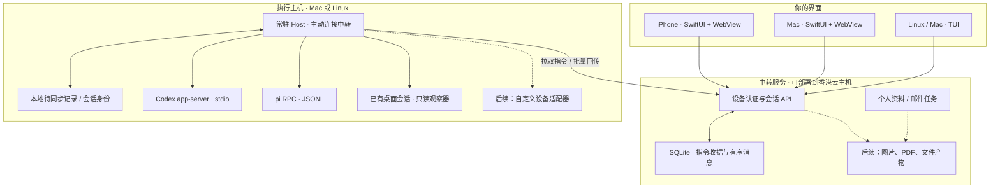

# oneAI：会话、主机与多端控制

状态：2026-09-21，可运行的首版；本地中转与 Simulator 已验收，尚未启用公网会话服务。

oneAI 管理会话的控制权、消息记录和设备连接；Codex / pi 负责执行。手机、Mac、TUI 使用同一套 API。pi extension 保留为可选的个人资料工具，不再承担应用主体。

## 架构

中转服务不启动手机端的模型进程，也不拿到执行主机的 Codex / pi 登录令牌。它保存用户指令与可见输出。执行主机只主动发起连接，无须向公网开放 Mac 端口。

Mac 关机后，中转仍可提供历史记录与已有邮件任务；运行在 Mac 上的 Codex 不会继续执行。要在 Mac 离线时执行编码任务，须另外配置 Linux 执行主机、对应工作目录及运行时登录。不能仅凭“用了云中转”宣称执行也已迁到云端。

## 两种会话，明确区分

| 模式 | 当前能力 | 控制权 |
|---|---|---|
| oneAI 托管 | 创建、文本消息、增量输出、停止、关闭、恢复 | 一个 Host 实例拥有该运行时进程；多个 oneAI 客户端共享 |
| 已有 Codex 桌面会话 | 绑定明确的 thread ID，分页读取已记录的用户/助手消息，约 5 秒同步 | 原桌面保留控制权；手机显示只读，服务端也拒绝控制指令 |

本机当前桌面进程使用 stdio，没有已运行的共享控制 socket。不能对正在执行的桌面 thread 再启动 `thread/resume`，然后声称这就是原会话的实时控制。观察器只调用 `initialize`、`account/read`、`thread/read`、`thread/items/list`；不复制 reasoning 或原始工具参数/输出。

观察器使用的独立 app-server 返回 `notLoaded`，仅表示该观察进程没有加载会话，不代表原桌面处于空闲。UI 因此显示“桌面会话 · 只读同步”，不编造执行状态。首轮仅加载尾部最多 500 个条目中的可见消息，后续遇到已同步条目即停止回扫；完整历史翻页入口尚未实现。

桌面原生客户端与 oneAI 托管客户端之间尚无跨进程控制权转移协议。请通过 oneAI 多端操作托管会话；在另一套原始客户端再次恢复同一托管 thread，仍可能绕过 oneAI 的单执行者约束。后续真正的接管需要共享 app-server 或显式交接，不能只依靠数据库中的会话 ID。

## 首版数据与一致性

- `Host`：独立凭证、工作空间别名、允许的 provider、心跳。工作空间路径和运行时二进制路径配置在执行主机侧，客户端只能选择别名。
- `Session`：稳定的 oneAI ID、所属 Host、provider、工作空间、模式、状态、版本。Codex 的 thread ID / pi 的持久化路径属于适配器内部身份。
- `Command`：客户端生成稳定 ID；重试同一内容返回原收据，更改内容则拒绝。所有状态写入使用事务，两个客户端基于同一版本发送只有一个能成功。
- `Event`：有序游标、唯一 ID、会话归属和结构化负载。浏览器增量读取；主机断网时先存入本地 SQLite，恢复后批量回传并去重。

指令等待超过 5 分钟不执行；派发后失去确认超过 60 秒显示“需要核对状态”，不会重新派发。这里提供的是**不自动重放有副作用的指令**，并非跨进程崩溃场景下的“恰好执行一次”。

停止先取消尚未派发的指令。pi 必须先 `clear_queue` 再 `abort`，否则停止后仍可能执行排队消息；只有 `agent_settled` 才表示自动重试、压缩和续跑全部结束。Codex 停止等待 `turn/completed`，不能把中断请求被接受当成已经停止。消息开始派发与停止请求有先后屏障，避免停止抢在消息写入前结束。

Host 用进程锁防止同一状态目录启动两份服务；监督进程在 Host 意外退出时终止其子运行时和工具进程组。重启保留会话身份和待上传输出，不重放输入。没有发过消息的 Codex 空会话可能尚未落盘，恢复时允许重新创建底层空 thread；一旦尝试发送过消息，就不以新建空会话掩盖恢复失败。

## 权限与当前限制

会话 API 默认关闭，需要管理员明确启用 `ONEAI_ENABLE_SESSIONS=1`。浏览器沿用设备配对、Cookie、CSRF 和同源限制。执行主机使用独立 Bearer 凭证，只能取得自己名下的指令和回传自己会话的事件，不能拿该凭证读取邮箱任务或充当浏览器登录。

Codex 明确使用 `workspace-write` 沙箱与 `on-request` / `user` 审批。首版尚未实现远程审批卡片，因此额外命令/文件授权会被拒绝，未知交互请求也不默认批准。pi 禁用扩展发现、技能和提示模板，仅启用 `read,grep,find,ls`；不开放 bash/edit/write。

**工作目录白名单不等于文件系统沙箱。** pi 的只读工具仍按主机账户权限读取文件；生产部署应使用专用系统账户/容器和必要的目录挂载。Codex 也受自身沙箱规则影响，不能把工作目录别名宣称为完整的保密边界。

当前是单用户产品，配对设备共享可见会话。不同家庭成员/协作者、按会话分享、只读设备角色、主机凭证轮换界面和远程审批均需要单独实现。首版最多展示最近 200 个会话，主机默认保留最多 4 个运行时进程；大规模历史归档和列表翻页不是本版已完成能力。

## 后续扩展顺序

1. **控制权交接和审批**：明确 `owner / lease / generation`；审批绑定会话、turn、具体请求和有效期，撤销与超时均失败关闭。支持已有会话的正式接管后再开启原生桌面与手机共同编辑。
2. **图片与产物**：独立 `Artifact(id, owner, mime, bytes, hash, origin)`；消息引用 artifact ID，不直接下发主机任意路径。受控上传、大小与格式验证、缩略图和历史授权检查。iPhone/Mac 内联展示，TUI 显示说明与受认证链接。当前仅预留事件类型，尚未实现图片上传/查看。
3. **自定义设备**：每个适配器公开命名操作、参数 schema、权限和取消语义，例如 `camera.capture`、`printer.preview`。设备操作进入同一个指令/结果记录，不允许用一个“任意 shell”端点代替所有设备接口。
4. **个人知识与会话连接**：资料检索输出稳定的 source reference；选中的论文、邮件、笔记作为显式上下文传给会话。原始 PDF、长期记忆和全部聊天记录分别管理，不把全部历史塞进一次模型上下文。
5. **更大规模**：事件归档、批量同步背压、会话分页、独立产物存储和指标。当前规模先保持模块化单体；测到数据库写入或队列瓶颈后，再拆执行队列/数据库服务。

## 实现入口

- `oneai/sessions/store.py`：中转持久化、命令事务、绑定模式。
- `oneai/sessions/host.py`：执行主机、待上传队列、实例锁。
- `oneai/sessions/adapters.py`：Codex/pi 协议、JSONL 生命周期。
- `oneai/sessions/observe.py`：已有 Codex 会话的只读同步。
- `oneai/web/static/sessions.js`：独立的共享会话界面。
- `oneai/sessions/terminal.py`：Linux/Mac 会话 TUI。

协议依据：[Codex App Server 官方文档](https://learn.chatgpt.com/docs/app-server)；并用本机 `codex-cli 0.155.0-alpha.9.2` 导出的 JSON schema 校对。pi 依据本机 `0.86.1` 安装包的 `docs/rpc.md`。PATH 中另有不支持 app-server 的旧 Codex CLI，所以注册主机必须明确指定经过验证的二进制路径。
