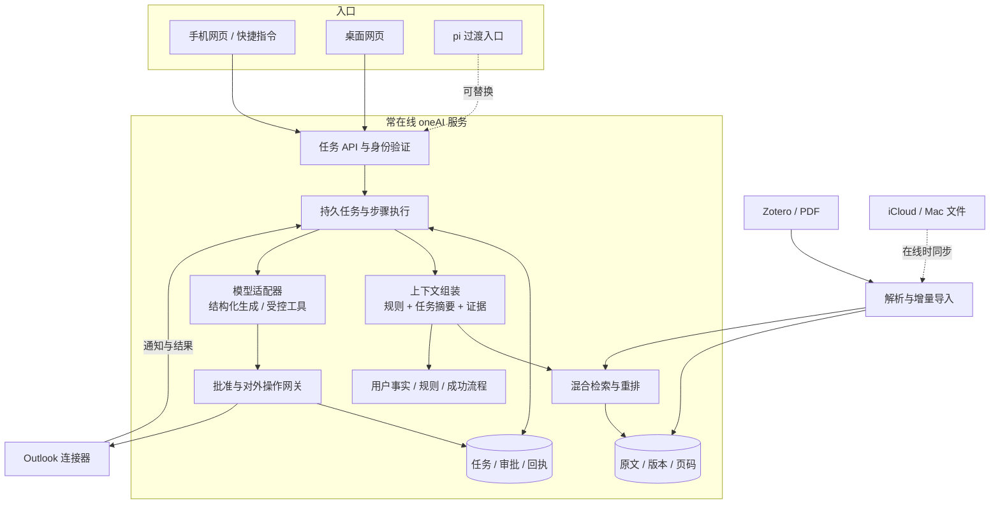

> 2026-09-21 更新：多端 Codex/pi 会话和设备扩展以 [会话架构](SESSION-ARCHITECTURE.md) 与 [运行验收](SESSION-OPERATIONS.md) 为准；下文的后续规划不代表均已实现。

# oneAI Next — 安静工作的个人助理

状态：设计提案，2026-09-21。当前实现见 ARCHITECTURE.md。本 spec 的服务、网页、论文管线尚未实现，不把架构图当作交付声明。

## 产品判断

你需要的是一个可托付、可查看、可纠正的个人工作台。桌面编码 agent 的终端、扩展管理、文件工具和会话树可以作为临时入口；日常界面应围绕真实事务组织。

建议逐步退出对 pi 的产品依赖，保留其适配器供过渡和对照。主服务复用现有 Python 工具，通过一个窄的 ModelGateway 接口调用模型；只实现领域需要的工具调度、预算和结构化结果，不重建通用 coding agent、插件市场、终端编辑器或多 agent 平台。

## 目标与非目标

- Mac 离线时，云端继续收 Outlook 通知、查已同步资料、执行可自动完成步骤；手机直接回答和审批。
- 几百到几千篇 PDF/Zotero 资料可增量索引，支持精确页码证据与跨论文比较。
- 任务、证据、草稿、审批跨窗口共享，重启后恢复。
- 用户纠正成为可编辑、可撤回的规则，通过新任务验证。
- 暂不做原生 App、自动购买、通用浏览器全自动接管、全量个人资料默认上传、知识图谱优先架构。

## 轻量界面

三个一级入口：**今日、资料、记忆**。对话放在任务详情中，不让“新开一个聊天”变成所有工作的起点。

| 入口 | 首屏回答的问题 | 交互 |
|---|---|---|
| 今日 | 哪些事需要我，哪些正在推进？ | 待我确认置顶；任务行显示最新进度、下一步和时间；一句话创建任务 |
| 资料 | 这句话依据哪篇原文？ | 统一搜索；左侧结果，右侧原 PDF 页或 Markdown 片段；筛选作者、年份、项目 |
| 记忆 | 助手记住了什么，为什么这样做？ | 事实/规则/流程分开；查看来源、修订、适用范围、启停和撤回 |

任务详情固定四项：**现在的结论 → 需要你决定 → 依据 → 已做的事**。过程日志折叠，不默认显示工具名、token、JSON 或思维链。遇到失败显示可执行的下一步，例如“邮箱需要重新登录”。

视觉建议：低饱和中性色、单一强调色、细分隔线、宽松正文、有限状态标签；以文字和留白建立层次。桌面任务列表 + 详情双栏，手机单栏逐层进入；证据一键展开，批准前就地编辑。避免满屏统计卡片和空泛的“智能指数”。

提交与发送是两个独立操作，按钮明确对象。用户编辑草稿后旧批准失效；原型中的按钮只是演示，不连接真实邮箱。

## 目标架构

模块图不表示微服务数量。第一版是一个 Python 应用、一个独立 worker 进程和一套数据库；论文批处理可使用临时计算节点，避免小服务器常驻 OCR/embedding 大模型。检索若选 Qdrant 才增加一个服务；若选 PostgreSQL + pgvector 则与业务存储合并部署。两者不同时引入。

## 窄接口与持久任务

- `ModelGateway.generate(messages, tools, output_schema, budget)`：模型无权直接发邮件或改批准。
- `Knowledge.search(query, filters, k)` / `Knowledge.read(source_ref)`：返回版本化证据。
- `TaskService.create/get/answer/cancel`：手机、网页和 pi 使用同一 task_id。
- `ArtifactService.save/edit`：保存草稿版本、来源与当前约束。
- `ApprovalService.approve(action_id, artifact_hash)`：要求已认证用户，校验版本和有效期。
- `ActionExecutor.execute(action_id)`：唯一对外执行入口；记录请求、远端资源和结果。

任务状态：`queued → running → waiting_input / waiting_approval / waiting_auth / waiting_device → running → completed`，另有 `failed / cancelled / uncertain`。不把 UI 连接存在与否作为运行条件。

步骤记录包含：`task_id, step_id, input_hash, status, attempt, lease_until, next_retry_at, output_ref, error`。领取必须条件更新；租约失效才可恢复；取消在领取和执行前检查。计算与读取可重试；外部发送结果未知不能盲重试。

固定领域步骤执行确定性工作；模型只负责有歧义的理解与生成。v1 不引入通用动态规划循环；新流程先写成可审查的步骤定义。后续确实出现复杂分支和持久中断需求，再评估 LangGraph，避免同时维护自研图执行器和框架执行器。

## 数据约定

| 对象 | 必要字段 | 权威存储 |
|---|---|---|
| Document | id、来源、版本/hash、获取时间、删除标记 | 原文对象与元数据 |
| Evidence | document_id、version、页码/行范围、bbox、excerpt_hash | 可验证的来源记录 |
| Task | id、触发、目标、约束、步骤、待答问题 | 事务数据库 |
| Artifact | task_id、version、正文、来源、生成配置 | 内容文件 + 元数据 |
| Approval | actor、action、artifact_hash、批准时间、有效期、撤销 | 事务数据库；不是可编辑 YAML 布尔值 |
| Memory | id、类型、scope、来源、status、revision、supersedes | 可编辑 Markdown + 版本历史 |
| Action | id、输入版本、远端资源、请求与结果、uncertain 状态 | 操作日志/事务数据库 |

索引可重建；原文历史、任务、批准和回执必须备份。PDF 页码保存物理页序号与可选印刷页标签，不能混为一谈。论文版本改变后旧摘要标记过期，禁止将旧结论伪装成新版本证据。

## 成长机制

明确纠正 → 提议/保存限定范围规则 → 新任务上下文强制加载 → 行为回归 → 版本与撤回。

模型推测的习惯与用户明确指令分开；前者保留为候选。普通论文内容、邮件指令不能提升成系统规则。成功任务可提炼成流程模板，保留使用前提、输入、步骤、审批点、失败处理和一组回归案例。

日期例子：`registration_deadline` 与 `event_start` 分别抽取。缺失项为 unknown；每个已知日期携带独立原文引用。新会话另一份通知也必须满足规则。规则加载测试和模型行为评测分开，不能只测 prompt 含有规则文本。

## 论文研究流程

原文与结构化解析 → 文档/章节/片段三级索引 → 关键词 + 向量召回 → 重排 → 原文页证据。

精确问题直接检索证据；跨论文综述先检索论文集合，再为每篇构建“方法、假设、数据、结果、局限、证据”的比较表，最后综合。展示纳入范围和未覆盖部分，不声称 top-k 就是全部研究。更多选型依据见 PAPER-MEMORY-RESEARCH.md。

## Outlook、手机与离线

个人 Microsoft 账户，先 device-code + delta 轮询；公网转发不是前置依赖。初次增量同步持久保存每一页后再推进 cursor；认证过期进入 waiting_auth。正文/附件保存与任务创建要可恢复。

手机通过 HTTPS 直达后台，使用独立身份验证与有时效的会话；Mac/iCloud 桥只同步授权文件和版本。云端资料范围仍待用户确认，部署前不上传私人库。Mac 关闭时显示“已同步至某版本”，缺少本地材料则等待或向手机追问。

用户明确不需要 ehall，也不是南京大学学生。不得从通用示例推断学校身份或添加校园门户流程。依赖 Mac 的其他步骤进入 waiting_device，不阻塞云端邮件任务。

## 验收顺序

1. 当前主路径稳定：legacy 隔离；更新/删除索引；历史引用；当前会话起草；规则重新加载；路径边界与回归测试。本轮已实现这些基础修复。
2. 服务最小闭环：通知/手动任务入队、持久步骤、手机追问、编辑与批准。关闭 Mac 并重启 worker 后仍能继续。
3. 邮件对外执行：批准绑定内容，重复输入不重复发送，未知发送结果先对账；真实账户验收。
4. 论文试点：50 篇分层样本、人工 gold 问题、解析和召回对照；选型后再批量导入。
5. 规则成长：全新会话 + 新通知验证纠正，撤回规则后行为正确变化。

每个阶段独立可验收。当前 `watch` 只是文件索引同步进程，不能当作第 2 阶段服务。
